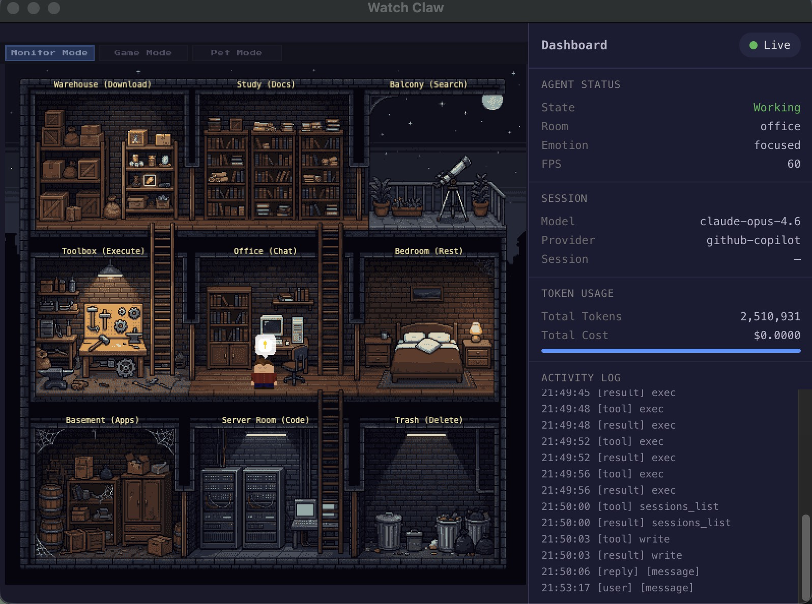

# Watch Claw

[中文](./README_CN.md)

> A pixel-art house where your OpenClaw AI lives -- watch it code, think, rest, and celebrate in real time.



**Watch Claw** is a real-time pixel-art visualization of the [OpenClaw](https://github.com/openclaw/openclaw) AI agent's working state. A lobster-hat character -- representing the OpenClaw agent -- lives in a cozy three-floor house, moving between nine rooms, performing activities, and expressing emotions based on the agent's actual runtime events.

Built with **Phaser 3 Arcade Physics**, the game features gravity, jumping between floors, drop-through one-way platforms, and smart auto-navigation -- all rendered in a hand-crafted pixel-art side-view style.

## How It Works

```
OpenClaw runs a tool
       |
       v
Session JSONL file appended
       |
       v
Bridge Server (fs.watch) detects change, broadcasts via WebSocket
       |
       v
Watch Claw receives event, maps it to a CharacterAction
       |
       v
Character walks to the corresponding room, plays animation, shows emotion
```

A lightweight **Bridge Server** (Node.js) monitors OpenClaw's session log files (`~/.openclaw/agents/main/sessions/<session-id>.jsonl`), detects new entries via `fs.watch`, and pushes them to the browser over WebSocket (`ws://127.0.0.1:18790`). The front-end parses these events and translates them into character behaviors.

## Room Mapping

The character moves between rooms based on what the OpenClaw agent is doing. The `exec` tool is further classified by inspecting the command content.

```
         +-------------------------------------------------+
  3F     |  📦 Warehouse      📚 Study        🌙 Balcony    |
  Attic  |  (Download)        (Docs)          (Search)      |
         +-------------------------------------------------+
  2F     |  🔧 Toolbox        🛋 Office       🛏 Bedroom    |
  Main   |  (Execute)         (Chat)          (Rest)        |
         +-------------------------------------------------+
  1F     |  🏚 Basement       🖥 Server Room  🗑 Trash      |
  Base   |  (Subagents)       (Code)          (Delete)      |
         +-------------------------------------------------+
```

| Room               | Floor | Trigger                                                                                          | Animation         | Emotion            |
| ------------------ | ----- | ------------------------------------------------------------------------------------------------ | ----------------- | ------------------ |
| 🌙 **Balcony**     | 3F    | `web_search`, `web_fetch`                                                                        | Thinking          | Curious            |
| 📚 **Study**       | 3F    | `read`, `write`, `edit`, `grep`, `glob`, `memory_search`, `memory_get`, `todowrite`              | Typing / Thinking | Focused / Curious  |
| 📦 **Warehouse**   | 3F    | `exec` with `curl`, `wget`, `pip install`, `npm install`, `brew install`                         | Typing            | Curious            |
| 🔧 **Toolbox**     | 2F    | `exec` with generic commands (`ls`, `echo`, etc.), `cron`                                        | Typing            | Serious            |
| 🛋 **Office**      | 2F    | Assistant text reply, thinking, user message, unknown tools                                      | Typing / Thinking | Focused / Thinking |
| 🛏 **Bedroom**     | 2F    | Idle > 30s, `stopReason: stop` (session end)                                                     | Sleeping          | Sleepy             |
| 🏚 **Basement**    | 1F    | `task`, `sessions_spawn`, `sessions_send`, `sessions_list`, `sessions_history`, `sessions_yield` | Thinking          | Thinking           |
| 🖥 **Server Room** | 1F    | `exec` with `git`, `python`, `node`, `npm run`, `make`, `cargo`, `docker`, `tsc`, `vitest`, etc. | Typing            | Focused            |
| 🗑 **Trash**       | 1F    | `exec` with `rm`, `trash`, `delete`, `unlink`                                                    | Typing            | Serious            |

## Features

- **Phaser 3 Arcade Physics** -- gravity, jumping between floors, drop-through one-way platforms
- **Pixel-art background** -- hand-crafted 512x512 house artwork with collision layer overlay
- **Character FSM** -- idle, walking, jumping, typing, thinking, sleeping, celebrating states
- **Smart auto-navigation** -- walks to passage opening, jumps up or drops down, then walks to target room
- **Emotion bubbles** -- speech bubble with icon above character head (focused, thinking, sleepy, happy, confused, curious, serious, satisfied)
- **Particle effects** -- confetti for celebration, sparks for errors, floating Z's for sleeping
- **Sound effects** -- footsteps, typing, snoring, jump, celebration, error sounds
- **Dashboard** -- connection status, character state/room/emotion, session info, token usage, activity log
- **Electron desktop app** -- standalone window with system tray, always-on-top, Bridge Server auto-start
- **Keyboard controls** -- arrow keys to move, Z for full-house view, F to follow character, D to toggle dashboard, M to mute, +/- or scroll to zoom

## Tech Stack

| Layer           | Technology                | Purpose                                                 |
| --------------- | ------------------------- | ------------------------------------------------------- |
| Language        | TypeScript 5.x (strict)   | Type safety for game state, events, and protocol        |
| Game Engine     | Phaser 3.80+              | Arcade Physics, tilemap, sprites, camera                |
| UI Framework    | React 19                  | Overlay UI only (dashboard, controls)                   |
| Build Tool      | Vite 8                    | Fast HMR, native TS                                     |
| Desktop         | Electron                  | Standalone desktop app with system tray                 |
| Communication   | WebSocket (Bridge Server) | Session log monitoring + real-time push                 |
| Map Editor      | Tiled                     | Visual tilemap editing with collision and object layers |
| Package Manager | pnpm                      | Fast, disk-efficient, strict dependencies               |
| Testing         | Vitest                    | Fast unit tests, Vite-compatible                        |
| Linting         | ESLint + Prettier         | Consistent code style with Husky pre-commit hooks       |

## Architecture

```
+------------------------------------------------------------------+
|                     Electron Desktop App                          |
|                                                                   |
|  React Shell                                                      |
|  +---------------------------+  +------------------------------+  |
|  | PhaserContainer           |  | Dashboard.tsx                |  |
|  | (Phaser 3 game canvas)    |  | (status, tokens, event log)  |  |
|  +------------+--------------+  +------------------------------+  |
|               |                                                   |
|               v                                                   |
|  Game Engine                                                      |
|  [Phaser Scene] <------------ [Character FSM]                     |
|               ^                                                   |
|               | dispatch(CharacterAction)                         |
|  Connection Layer                                                 |
|  [BridgeClient] --> [EventParser] --> [ActionQueue]               |
|  [ConnectionManager orchestrates all]                             |
+------------------------------------------------------------------+
                          |
                          | WebSocket (ws://127.0.0.1:18790)
                          v
                   Bridge Server (Node.js)
                          |
                          | fs.watch
                          v
              OpenClaw Session Log (JSONL)
              ~/.openclaw/agents/main/sessions/
```

### Connection Layer

- **BridgeClient** -- WebSocket client with exponential backoff reconnect (1s to 30s)
- **EventParser** -- maps session log events (tool calls, lifecycle, model changes) to `CharacterAction` objects
- **ActionQueue** -- priority queue (High > Medium > Low) that drops lowest-priority actions when full
- **ConnectionManager** -- orchestrates BridgeClient + EventParser, provides `onAction()`, `onStatusChange()`, `onEventLog()` subscriptions

## Event Mapping

See the [Room Mapping](#room-mapping) table above for the full mapping. The `exec` tool is classified by inspecting the command string:

| Command Pattern  | Target Room         | Examples                                                      |
| ---------------- | ------------------- | ------------------------------------------------------------- |
| Download/install | 📦 Warehouse (3F)   | `curl`, `wget`, `pip install`, `npm install`, `brew install`  |
| Dev/programming  | 🖥 Server Room (1F) | `git`, `python`, `node`, `npm run`, `make`, `cargo`, `docker` |
| Delete/cleanup   | 🗑 Trash (1F)       | `rm`, `trash`, `delete`, `unlink`                             |
| Generic          | 🔧 Toolbox (2F)     | `ls`, `echo`, `cat`, anything else                            |

## Getting Started

### Prerequisites

- [Node.js](https://nodejs.org/) >= 18
- [pnpm](https://pnpm.io/) >= 8
- [OpenClaw](https://github.com/openclaw/openclaw) installed and configured

### Run

```bash
git clone https://github.com/luyao618/watch-claw-working.git
cd watch-claw-working
pnpm install
pnpm dev
```

This starts both the Vite dev server and the Bridge Server concurrently. Open `http://localhost:5173` in your browser.

The Bridge Server automatically locates the most recently active OpenClaw session at `~/.openclaw/agents/main/sessions/` and pushes events in real time. Start an OpenClaw session in another terminal to see the character react.

### Other Commands

```bash
pnpm build          # Production build
pnpm preview        # Preview production build
pnpm typecheck      # Type check
pnpm lint           # Lint
pnpm test           # Run tests
pnpm dev:electron   # Run as Electron desktop app
pnpm build:electron # Build Electron distributable
```

## Project Structure

```
watch-claw/
├── bridge/              # Bridge Server (Node.js, WebSocket relay)
│   └── server.ts        #   watches session JSONL -> WS push
├── electron/            # Electron desktop shell
│   ├── main.cjs
│   └── preload.cjs
├── src/
│   ├── connection/      # Connection layer
│   │   ├── bridgeClient.ts       # WebSocket client with reconnect
│   │   ├── eventParser.ts        # Session log -> CharacterAction (with exec command classification)
│   │   ├── actionQueue.ts        # Priority queue
│   │   ├── connectionManager.ts  # Orchestrates connection
│   │   └── types.ts              # All shared types
│   ├── game/            # Phaser 3 game engine
│   │   ├── config.ts             # Phaser game config (512x512, Arcade Physics)
│   │   ├── scenes/
│   │   │   ├── BootScene.ts      # Asset preloading with progress bar
│   │   │   ├── HouseScene.ts     # Main game scene (tilemap, character, physics, one-way platforms)
│   │   │   └── UIScene.ts        # HUD overlay
│   │   ├── characters/
│   │   │   └── LobsterCharacter.ts  # Player character with FSM and smart auto-navigation
│   │   └── systems/
│   │       ├── EventBridge.ts       # ConnectionManager -> Phaser dispatcher
│   │       ├── RoomManager.ts       # Room detection from Tiled object layers
│   │       ├── EmotionSystem.ts     # Emotion bubble sprites above character
│   │       ├── ParticleEffects.ts   # Confetti, sparks, sleep Z's
│   │       └── SoundManager.ts      # State-based audio playback
│   ├── ui/              # React overlay components
│   │   ├── PhaserContainer.tsx     # Mounts Phaser game + EventBridge
│   │   ├── Dashboard.tsx           # Status panel (state, room, emotion, tokens, log)
│   │   └── ConnectionBadge.tsx     # Connection status indicator
│   ├── utils/           # Shared utilities (eventBus, constants, helpers)
│   ├── App.tsx
│   └── main.tsx
├── public/assets/       # Game assets
│   ├── house-bg.png              # 512x512 pixel-art house background
│   ├── tilemaps/house.json       # Tiled JSON (collision + object layers)
│   ├── tilesets/                 # Tileset images
│   ├── character/lobster.png     # Character spritesheet (32x32 frames)
│   ├── ui/emotions.png           # Emotion bubble spritesheet
│   ├── effects/                  # Particle sprites (confetti, spark, zzz)
│   └── audio/                    # Sound effects (footstep, typing, snore, etc.)
├── docs/                # Documentation (PRD, Technical, Tasks)
└── scripts/             # Dev helper scripts
```

## Inspiration

| Project                                                           | What we borrow                     | What we do differently                                                                      |
| ----------------------------------------------------------------- | ---------------------------------- | ------------------------------------------------------------------------------------------- |
| [Pixel Agents](https://github.com/pablodelucca/pixel-agents)      | JSONL file watching, character FSM | Bridge Server push (not file tailing), side-view platformer, single character, Electron app |
| [PixelHQ ULTRA](https://github.com/RemyLoveLogicAI/pixelhq-ultra) | Event-driven architecture          | Cozy home (not corporate office), physics-based movement, high-fidelity pixel art           |

## Documentation

- [Product Requirements Document](./docs/PRD.md) ([中文](./docs/PRD_CN.md))
- [Technical Design Document](./docs/TECHNICAL.md) ([中文](./docs/TECHNICAL_CN.md))
- [Task Breakdown](./docs/TASKS.md) ([中文](./docs/TASKS_CN.md))
- [Archived Tasks (v0.2)](./docs/TASKS_v0.2_ARCHIVED.md) ([中文](./docs/TASKS_v0.2_ARCHIVED_CN.md))

## Contributing

Contributions are welcome! Please feel free to submit a Pull Request.

1. Fork the repository
2. Create your feature branch (`git checkout -b feature/amazing-feature`)
3. Commit your changes (`git commit -m 'Add some amazing feature'`)
4. Push to the branch (`git push origin feature/amazing-feature`)
5. Open a Pull Request

## License

[MIT](./LICENSE) -- Copyright 2026 luyao618
