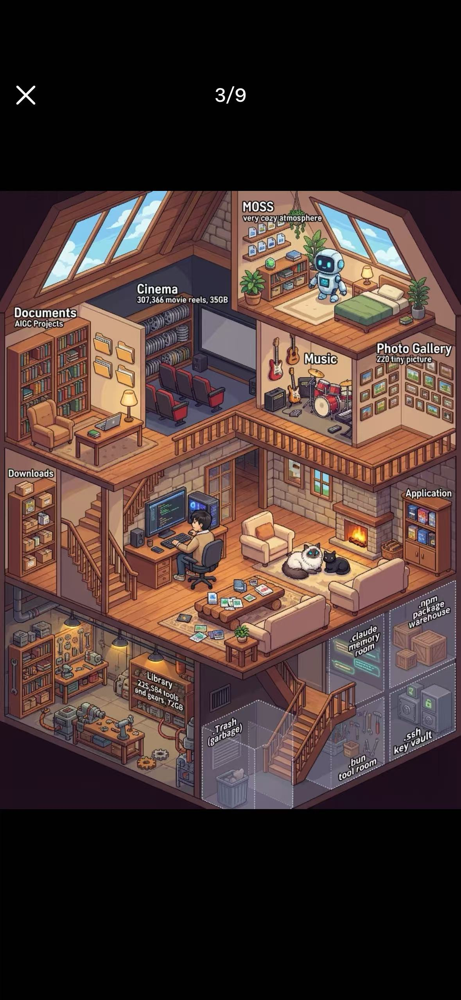

# Watch Claw

[中文](./README_CN.md)

> A pixel-art house where your OpenClaw AI lives -- watch it code, think, rest, and celebrate in real time.

> **Status**: Under active development -- currently in MVP (v0.1) planning phase.



**Watch Claw** is a real-time pixel-art visualization of the [OpenClaw](https://github.com/openclaw/openclaw) AI agent's working state. It renders an isometric, cross-section view of a cozy three-story house where a lobster-hat character -- representing the OpenClaw agent -- moves between rooms, performs activities, and expresses emotions based on the agent's actual runtime status.

### Who Is This For?

- OpenClaw users who want a fun, ambient visualization of their AI agent's activity
- Developers who enjoy pixel-art aesthetics and "digital pet" style companions

## How It Works

```
OpenClaw does something --> Event arrives via WebSocket --> Character moves to room --> Animation plays
```

Watch Claw connects to the OpenClaw Gateway via WebSocket (`ws://127.0.0.1:18789`), parses real-time agent events (tool calls, lifecycle phases, presence), and translates them into character behaviors: walking to the office to code, sitting on the couch to think, sleeping in bed when idle.

## Features

### MVP (v0.1) -- One Floor, Three Rooms

| Room | Agent Activity | Character Behavior | Emotion |
|------|---------------|-------------------|---------|
| **Office** | `Write`, `Edit`, `Bash`, assistant streaming | Sitting at desk, typing | Focused |
| **Living Room** | `Read`, `Grep`, `Glob`, `WebFetch`, thinking | Sitting on couch | Thinking |
| **Bedroom** | Idle, waiting for input, session end | Lying in bed, sleeping | Sleepy |

### Core Capabilities

- **Real-time WebSocket connection** -- connects to OpenClaw Gateway, handles handshake, auto-reconnects with exponential backoff
- **Smart event parsing** -- maps agent tool calls and lifecycle events to character actions with priority-based queueing
- **Mock mode** -- when Gateway is unavailable, generates simulated events for development and demo
- **Isometric Canvas 2D rendering** -- pixel-perfect isometric view with painter's algorithm z-sorting
- **Character state machine** -- 5 MVP states (idle, walk, sit, type, sleep) expandable to 7 in v1.0 (+ thinking, celebrating)
- **BFS pathfinding** -- tile-based pathfinding for natural character movement between rooms
- **Emotion bubbles** -- visual feedback above the character: focused, thinking, sleepy, happy, confused
- **Status dashboard** -- connection status and mode (live/mock), current agent state, token usage, session info, activity log

### Full Version (v1.0) -- Three Floors, Nine Rooms

```
              ATTIC (3F)
    +--------+--------+--------+
    | Reading|  Lab   |Balcony |
    |  Room  |        |        |
    +--------+--------+--------+
             MAIN FLOOR (2F)
    +--------+--------+--------+
    | Office | Living |Bedroom |
    |        |  Room  |        |
    +--------+--------+--------+
             BASEMENT (1F)
    +--------+--------+--------+
    |  Tool  |Storage |Kitchen |
    |  Room  |        |        |
    +--------+--------+--------+
```

Key additions in v1.0:

- **Staircase navigation** -- character walks between floors with animation
- **Sound effects** -- footsteps, typing, snoring, cooking sounds, notification chimes
- **Electron desktop app** -- standalone window, system tray, always-on-top option
- **Sub-agent visualization** -- companion character appears when OpenClaw spawns sub-agents
- **Activity history** -- timeline of recent agent activities with timestamps
- **Custom themes** -- light/dark mode, seasonal themes
- **Pet companion** -- a small pixel pet that reacts to the agent's mood

### Roadmap

Planned features beyond MVP (P1):

- Zoom controls (mouse wheel / +/- buttons)
- Viewport panning (click-drag)
- Character click interaction (detailed agent info popup)
- Day/night ambient lighting based on time of day

## Tech Stack

| Layer | Technology | Why |
|-------|-----------|-----|
| Language | TypeScript 5.x (strict) | Type safety for game state, events, and protocol |
| UI Framework | React 18 | Overlay UI only; game state lives outside React |
| Rendering | Canvas 2D API | Pixel-perfect control, integer scaling, small bundle |
| Build Tool | Vite 6 | Fast HMR, native TS, simple config |
| Communication | Native WebSocket | Direct connection to OpenClaw Gateway |
| State Management | Imperative game state + React useReducer (UI) | 60fps game world without React re-render overhead |
| Package Manager | pnpm | Fast, disk-efficient, strict dependencies |
| Linting | ESLint + Prettier | Consistent code style, type-aware linting |
| Testing | Vitest | Fast unit tests, Vite-compatible |

## Architecture

```
+----------------------------------------------------------------+
|                        Browser (Web App)                        |
|                                                                 |
|   React Shell (CanvasView + Dashboard)                          |
|       |                          |                              |
|       | ref                      | subscribe (EventBus, 4Hz)    |
|       v                          v                              |
|   Game Engine (imperative, 60fps)                               |
|   [GameLoop] -> [Renderer] [Character FSM] [Pathfinding BFS]   |
|       |                                                         |
|       v                                                         |
|   GameState (plain TS object, mutated imperatively)             |
|       ^                                                         |
|       | dispatch(action)                                        |
|   Connection Layer                                              |
|   [GatewayClient (WS)] -> [EventParser] -> [MockProvider]      |
+----------------------------------------------------------------+
                          |
                          | WebSocket
                          v
               OpenClaw Gateway
               ws://127.0.0.1:18789
```

### Key Design Decisions

1. **Game state lives outside React** -- 60fps updates without re-render cascades. React components subscribe to specific slices via EventBus, throttled to 4Hz.
2. **Single Canvas, no DOM tiles** -- pixel-perfect isometric rendering with proper z-ordering via painter's algorithm.
3. **WebSocket-first** -- real-time push, structured event types, no polling delay.

## Getting Started

### Prerequisites

- [Node.js](https://nodejs.org/) >= 18
- [pnpm](https://pnpm.io/) >= 8
- [OpenClaw](https://github.com/openclaw/openclaw) (optional -- falls back to mock mode)

### Installation

```bash
# Clone the repository
git clone https://github.com/luyao618/watch-claw-working.git
cd watch-claw-working

# Install dependencies
pnpm install

# Start development server
pnpm dev
```

The app opens at `http://localhost:5173`. If OpenClaw Gateway is running on `ws://127.0.0.1:18789`, it connects automatically. Otherwise, it falls back to mock mode with simulated events.

### Build

```bash
# Production build
pnpm build

# Preview production build
pnpm preview

# Type check
pnpm typecheck

# Lint
pnpm lint

# Run tests
pnpm test
```

## Event Mapping

Watch Claw translates OpenClaw events into character actions:

| OpenClaw Event | Target Room | Animation | Emotion | Priority |
|---------------|-------------|-----------|---------|----------|
| `lifecycle.start` | Living Room | Wake up | Thinking | High |
| `lifecycle.end` | Bedroom | Lie down | Sleepy | High |
| `lifecycle.error` | (current) | Hold head | Confused | High |
| `tool: Write/Edit` | Office | Typing | Focused | Medium |
| `tool: Bash` | Office | Typing | Serious | Medium |
| `tool: Read/Grep/Glob` | Living Room | Sitting | Curious | Medium |
| `tool: WebFetch` | Living Room | Browsing | Curious | Medium |
| `tool: Task` | Living Room | Thinking | Thinking | Medium |
| Task completed | Living Room | Celebrating | Satisfied | Medium |
| Assistant streaming | Office | Typing | Focused | Low |
| Idle > 30s | Bedroom | Sleeping | Sleepy | Low |

## Non-Functional Requirements

| Requirement | Target |
|-------------|--------|
| Frame rate | 60fps (requestAnimationFrame) |
| Bundle size | < 500KB gzipped |
| Browser support | Chrome 90+, Firefox 90+, Safari 15+, Edge 90+ |
| Responsive | Min 800x600, scales to 4K |
| Startup time | < 2s to first meaningful paint |
| WebSocket reconnect | Exponential backoff (1s-30s) |
| Mock mode fallback | < 100ms switch |
| Memory usage | < 100MB |
| Accessibility | Reduced motion support (`prefers-reduced-motion`) |

## Inspiration

| Project | What we borrow | What we do differently |
|---------|---------------|----------------------|
| [Pixel Agents](https://github.com/pablodelucca/pixel-agents) | JSONL file watching, character FSM, Canvas 2D | WebSocket (not file tailing), isometric (not top-down), single character |
| [PixelHQ ULTRA](https://github.com/RemyLoveLogicAI/pixelhq-ultra) | Event-driven architecture, personality engine | Cozy home (not office), high-fidelity pixel art (not DOM tiles) |

## Documentation

- [Product Requirements Document](./docs/PRD.md)
- [Technical Design Document](./docs/TECHNICAL.md)
- [Task Breakdown](./docs/TASKS.md)

## Contributing

Contributions are welcome! Please feel free to submit a Pull Request.

1. Fork the repository
2. Create your feature branch (`git checkout -b feature/amazing-feature`)
3. Commit your changes (`git commit -m 'Add some amazing feature'`)
4. Push to the branch (`git push origin feature/amazing-feature`)
5. Open a Pull Request

## License

This project is licensed under the [MIT License](./LICENSE).
