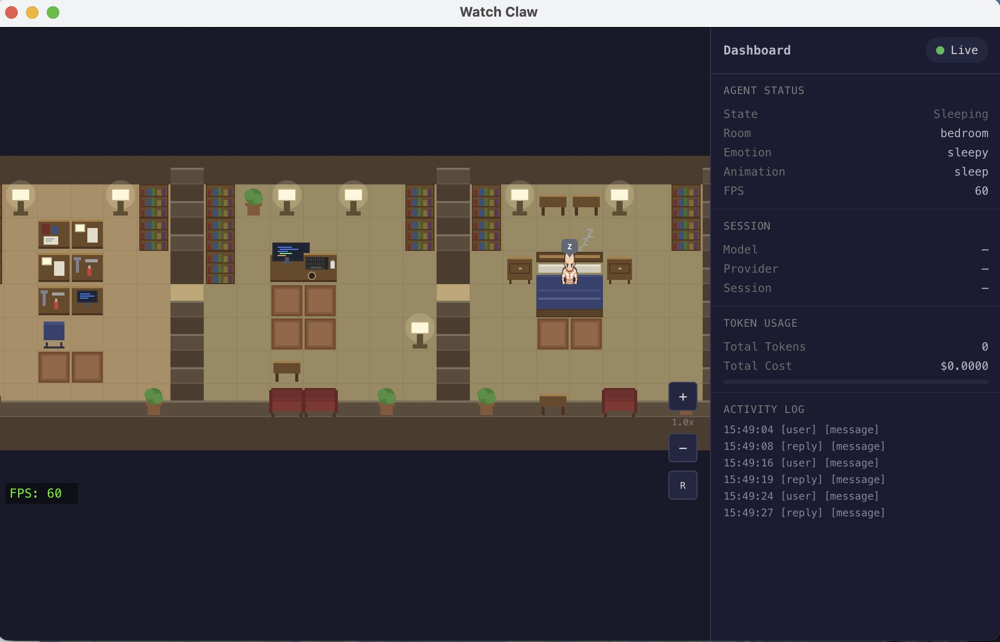

# Watch Claw

[English](./README.md)

> 一个像素风小屋，你的 OpenClaw AI 就住在里面 -- 实时观看它写代码、思考、休息和庆祝。


_v0.2 运行中，使用程序化生成的占位素材 -- 新的前端界面和像素美术素材正在开发中。_

**Watch Claw** 是 [OpenClaw](https://github.com/openclaw/openclaw) AI 代理工作状态的实时像素风可视化工具。一个戴着龙虾帽的角色 -- 代表 OpenClaw 代理 -- 住在一个温馨的小屋里，根据代理的实际运行事件在房间之间移动、执行活动并表达情感。

当前版本 (v0.2) 使用 Canvas 2D 渲染单层三房的小屋。项目正在向 **Phaser 3** 迁移，采用横版平台跳跃风格，扩展为三层九房的小屋 (v1.0)。

## 工作原理

```
OpenClaw 执行工具
       |
       v
Session JSONL 文件追加新行
       |
       v
Bridge Server (fs.watch) 检测变化，通过 WebSocket 广播
       |
       v
Watch Claw 接收事件，映射为 CharacterAction
       |
       v
角色走到对应房间，播放动画，显示情绪
```

轻量级 **Bridge Server**（Node.js）监控 OpenClaw 的会话日志文件（`~/.openclaw/agents/main/sessions/<session-id>.jsonl`），通过 `fs.watch` 检测新条目，并通过 WebSocket（`ws://127.0.0.1:18790`）推送到浏览器。前端解析这些事件并转化为角色行为。

## 当前状态 (v0.2)

v0.2 已完全可用，具有单层三房布局：

| 房间       | 代理活动                             | 角色行为     | 情绪 |
| ---------- | ------------------------------------ | ------------ | ---- |
| **工作室** | `write`、`edit`、`exec`、助手文本流  | 坐在桌前打字 | 专注 |
| **书房**   | `read`、`grep`、`glob`、`web_search` | 浏览书架     | 思考 |
| **卧室**   | 空闲 > 30 秒、会话结束               | 躺在床上睡觉 | 困倦 |

### 已实现功能

- **Bridge Server** -- 监控最近活跃的会话 JSONL，自动检测会话切换（每 2 秒轮询），通过 WebSocket 推送事件，支持自动重连
- **事件解析** -- 将工具调用（`write`、`edit`、`exec`、`read`、`grep`、`glob`、`web_search`、`task`）和生命周期事件映射为 `CharacterAction` 对象，支持优先级队列
- **Canvas 2D 渲染** -- 3/4 俯视等距视角，画家算法处理 Z 轴排序，程序化生成像素风家具
- **角色状态机** -- idle、walk、sit、type、sleep、think、celebrate 状态，BFS 瓦片寻路
- **情绪气泡** -- 专注、思考、困倦、开心、困惑、好奇、严肃、满足
- **状态面板** -- 连接状态、当前代理状态、会话信息、事件日志、FPS 计数器
- **Electron 桌面应用** -- 独立窗口，系统托盘，置顶选项，macOS/Windows/Linux 构建

## v1.0 路线图（Phaser 3 迁移）

v1.0 将手写的 Canvas 2D 渲染器替换为 **Phaser 3**，从 3/4 俯视视角切换为 **横版平台跳跃** 风格，支持基于物理的移动（重力、跳跃、爬梯子）。

### 三层小屋（9 个房间）

```
         +-------------------------------------------------+
  3F     |  仓库            书房            阳台             |
  阁楼   |  (glob/文件)     (read/grep)    (web_search)     |
         |      |--|            |--|                        |
         +------+  +------------+  +------------------------+
  2F     |  工具间          办公室          卧室             |
  主楼层 |  (exec)          (write/edit)   (idle/sleep)     |
         |      |--|            |--|                        |
         +------+  +------------+  +------------------------+
  1F     |  地下室          机房            垃圾桶           |
  底层   |  (task/agents)   (code)         (cleanup)        |
         +-------------------------------------------------+
              ^ 楼梯/梯子连接各楼层 ^
```

### 迁移阶段

| 阶段 | 范围                                | 状态   |
| ---- | ----------------------------------- | ------ |
| P0   | Phaser 引导、React 挂载、加载进度条 | 待开始 |
| P1   | Tiled 瓦片地图、碰撞层、房间检测    | 待开始 |
| P2   | 角色精灵、状态机、物理、自动导航    | 待开始 |
| P3   | 事件桥接、情绪系统、粒子效果        | 待开始 |
| P4   | 面板更新、音效、Electron 优化       | 待开始 |
| P5   | 三层扩展、完整事件映射              | 待开始 |

### v1.0 关键变化

- **Phaser 3 Arcade Physics** -- 重力、速度、平台碰撞器、梯子攀爬区域
- **Tiled 瓦片地图** -- 可视化地图编辑，包含碰撞层和对象层（房间区域、出生点、活动点）
- **横版平台移动** -- 行走、跳跃、攀爬（替代 BFS 寻路）
- **三层 9 个房间** -- 每个工具映射到特定房间
- **音效** -- 脚步声、打字声、鼾声、庆祝提示音
- **粒子效果** -- 庆祝彩纸、错误火花、睡眠浮动 Z 字符

## 技术栈

| 层级       | 技术选型                          | 用途                               |
| ---------- | --------------------------------- | ---------------------------------- |
| 语言       | TypeScript 5.x（严格模式）        | 为游戏状态、事件和协议提供类型安全 |
| 游戏引擎   | Canvas 2D (v0.2)、Phaser 3 (v1.0) | 渲染与物理                         |
| UI 框架    | React 19                          | 仅用于覆盖层 UI（面板、控件）      |
| 构建工具   | Vite 8                            | 快速 HMR，原生 TS 支持             |
| 桌面应用   | Electron                          | 独立桌面应用，系统托盘             |
| 通信       | WebSocket（Bridge Server）        | 会话日志监控 + 实时推送            |
| 地图编辑器 | Tiled (v1.0)                      | 可视化瓦片地图编辑，碰撞层和对象层 |
| 包管理器   | pnpm                              | 快速、节省磁盘、严格依赖解析       |
| 测试       | Vitest                            | 快速单元测试，兼容 Vite            |
| 代码规范   | ESLint + Prettier                 | 统一代码风格，Husky 预提交钩子     |

## 架构设计

```
+------------------------------------------------------------------+
|                     Electron 桌面应用                              |
|                                                                   |
|  React Shell                                                      |
|  +---------------------------+  +------------------------------+  |
|  | PhaserContainer (v1.0)    |  | Dashboard.tsx                |  |
|  | 或 CanvasView (v0.2)      |  | (状态、Token、事件日志)      |  |
|  +------------+--------------+  +------------------------------+  |
|               |                                                   |
|               v                                                   |
|  游戏引擎                                                         |
|  [Phaser Scene / Canvas 2D] <-- [角色状态机]                      |
|               ^                                                   |
|               | dispatch(CharacterAction)                         |
|  连接层（稳定，v0.2 和 v1.0 共用）                                 |
|  [BridgeClient] --> [EventParser] --> [ActionQueue]               |
|  [ConnectionManager 统一调度]                                     |
+------------------------------------------------------------------+
                          |
                          | WebSocket (ws://127.0.0.1:18790)
                          v
                   Bridge Server (Node.js)
                          |
                          | fs.watch
                          v
              OpenClaw 会话日志 (JSONL)
              ~/.openclaw/agents/main/sessions/
```

### 连接层（跨版本稳定）

连接层已完全可用，在 v0.2 和 v1.0 之间共享：

- **BridgeClient** -- WebSocket 客户端，支持指数退避自动重连（1s 至 30s）
- **EventParser** -- 将会话日志事件（工具调用、生命周期、模型切换）映射为 `CharacterAction` 对象
- **ActionQueue** -- 优先级队列（高 > 中 > 低），队列满时丢弃最低优先级动作
- **ConnectionManager** -- 统一调度 BridgeClient + EventParser，提供 `onAction()`、`onStatusChange()`、`onEventLog()` 订阅接口

## 事件映射

| OpenClaw 事件                | 工具 / 阶段 | 目标房间     | 动画 | 情绪 | 优先级 |
| ---------------------------- | ----------- | ------------ | ---- | ---- | ------ |
| 会话开始 (`type: session`)   | --          | 书房         | 起床 | 思考 | 高     |
| 会话结束 (`stopReason`)      | --          | 卧室         | 躺下 | 困倦 | 高     |
| 工具执行失败 (exitCode != 0) | --          | （当前房间） | 抱头 | 困惑 | 高     |
| `tool: write`                | write       | 工作室       | 打字 | 专注 | 中     |
| `tool: edit`                 | edit        | 工作室       | 打字 | 专注 | 中     |
| `tool: exec`                 | exec        | 工作室       | 打字 | 严肃 | 中     |
| `tool: read`                 | read        | 书房         | 阅读 | 好奇 | 中     |
| `tool: grep`                 | grep        | 书房         | 搜索 | 好奇 | 中     |
| `tool: glob`                 | glob        | 书房         | 浏览 | 忙碌 | 中     |
| `tool: web_search`           | web_search  | 书房         | 浏览 | 好奇 | 中     |
| `tool: task`                 | task        | 书房         | 白板 | 兴奋 | 中     |
| 助手文本流                   | --          | 工作室       | 打字 | 专注 | 低     |
| 空闲 > 30 秒                 | --          | 卧室         | 睡觉 | 困倦 | 低     |

## 快速开始

### 前置条件

- [Node.js](https://nodejs.org/) >= 18
- [pnpm](https://pnpm.io/) >= 8
- [OpenClaw](https://github.com/openclaw/openclaw) 已安装并配置

### 运行

```bash
git clone https://github.com/luyao618/watch-claw-working.git
cd watch-claw-working
pnpm install
pnpm dev
```

这会同时启动 Vite 开发服务器和 Bridge Server。在浏览器中打开 `http://localhost:5173`。

Bridge Server 会自动定位 `~/.openclaw/agents/main/sessions/` 中最近活跃的 OpenClaw 会话并实时推送事件。在另一个终端启动 OpenClaw 会话即可看到角色反应。

### 其他命令

```bash
pnpm build          # 生产构建
pnpm preview        # 预览生产构建
pnpm typecheck      # 类型检查
pnpm lint           # 代码检查
pnpm test           # 运行测试
pnpm dev:electron   # 以 Electron 桌面应用运行
pnpm build:electron # 构建 Electron 可分发包
```

## 项目结构

```
watch-claw/
├── bridge/              # Bridge Server (Node.js, WebSocket 中继)
│   └── server.ts        #   监控会话 JSONL -> WS 推送
├── electron/            # Electron 桌面外壳
│   ├── main.cjs
│   └── preload.cjs
├── src/
│   ├── connection/      # 连接层（稳定，请勿修改）
│   │   ├── bridgeClient.ts       # WebSocket 客户端，自动重连
│   │   ├── eventParser.ts        # 会话日志 -> CharacterAction
│   │   ├── actionQueue.ts        # 优先级队列
│   │   ├── connectionManager.ts  # 统一调度连接
│   │   └── types.ts              # 所有共享类型
│   ├── engine/          # Canvas 2D 游戏引擎 (v0.2, 待替换)
│   ├── world/           # 瓦片地图和房间定义 (v0.2, 待替换)
│   ├── ui/              # React 覆盖层组件
│   │   ├── CanvasView.tsx        # 游戏画布挂载
│   │   └── Dashboard.tsx         # 状态面板
│   ├── utils/           # 共享工具（eventBus, constants, helpers）
│   ├── App.tsx
│   └── main.tsx
├── public/assets/       # 游戏资源（精灵、瓦片集、瓦片地图）
├── docs/                # 文档（PRD、技术设计、任务分解）
└── scripts/             # 开发辅助脚本
```

## 灵感来源

| 项目                                                              | 借鉴之处                 | 差异之处                                                                     |
| ----------------------------------------------------------------- | ------------------------ | ---------------------------------------------------------------------------- |
| [Pixel Agents](https://github.com/pablodelucca/pixel-agents)      | JSONL 文件监听、角色 FSM | Bridge Server 推送（非文件尾随）、横版平台跳跃 (v1.0)、单角色、Electron 应用 |
| [PixelHQ ULTRA](https://github.com/RemyLoveLogicAI/pixelhq-ultra) | 事件驱动架构             | 温馨小屋（非办公室）、基于物理的移动 (v1.0)、高保真像素风                    |

## 文档

- [产品需求文档 (PRD)](./docs/PRD.md)（[中文](./docs/PRD_CN.md)）
- [技术设计文档](./docs/TECHNICAL.md)（[中文](./docs/TECHNICAL_CN.md)）
- [任务分解 (v1.0)](./docs/TASKS.md)（[中文](./docs/TASKS_CN.md)）
- [已归档任务 (v0.2)](./docs/TASKS_v0.2_ARCHIVED.md)（[中文](./docs/TASKS_v0.2_ARCHIVED_CN.md)）

## 贡献

欢迎贡献代码！请随时提交 Pull Request。

1. Fork 本仓库
2. 创建功能分支 (`git checkout -b feature/amazing-feature`)
3. 提交更改 (`git commit -m 'Add some amazing feature'`)
4. 推送分支 (`git push origin feature/amazing-feature`)
5. 发起 Pull Request

## 开源协议

[MIT](./LICENSE) -- Copyright 2026 luyao618
