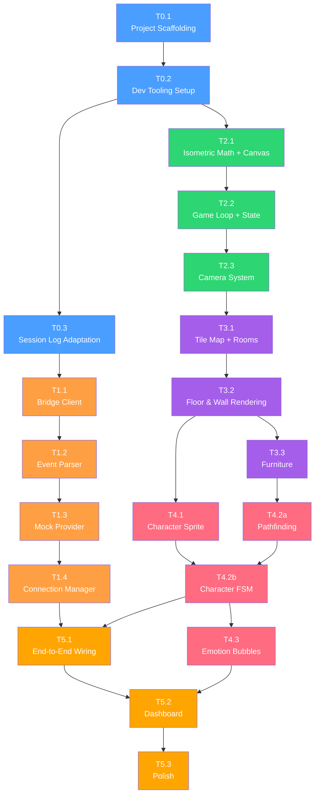

# Watch Claw - Task Breakdown

> **Version**: 0.1.0 (Draft)
> **Date**: 2026-03-22
> **Granularity**: ~half-day per task
> **Total estimated tasks**: 20 tasks across 6 phases

---

## Overview

This document breaks down the Watch Claw MVP into concrete, sequentially executable tasks. Each task is designed to take approximately **half a day** (3-4 hours) of focused development work.

### Phase Summary

| Phase | Name                 | Tasks | Scope                                                          |
| ----- | -------------------- | ----- | -------------------------------------------------------------- |
| P0    | Project Bootstrap    | 3     | Scaffolding, tooling, dev environment, architecture adaptation |
| P1    | Connection Layer     | 4     | Bridge client, event parsing, mock provider                    |
| P2    | Engine Foundation    | 3     | Game loop, isometric renderer, camera                          |
| P3    | World Building       | 3     | Tile map, rooms, furniture                                     |
| P4    | Character System     | 4     | Sprites, FSM, pathfinding, emotions                            |
| P5    | Integration & Polish | 3     | End-to-end wiring, dashboard, polish                           |

---

## Phase 0: Project Bootstrap

### T0.1 — Project Scaffolding

> Initialize the Vite + React + TypeScript project with the complete directory structure.

**Depends on**: Nothing (starting point)

**Work items**:

- Initialize project with `pnpm create vite@latest . --template react-ts`
- Configure `tsconfig.json` with strict mode, path aliases (`@/` → `src/`)
- Configure `vite.config.ts` with path alias resolution
- Create the full directory structure as defined in TECHNICAL.md Section 3:
  - `src/connection/`
  - `src/engine/`
  - `src/world/`
  - `src/ui/`
  - `src/utils/`
  - `public/assets/character/`, `public/assets/tiles/`, `public/assets/furniture/`, `public/assets/ui/`
- Create stub `index.ts` or placeholder files in each directory
- Set up `src/main.tsx` → `src/App.tsx` with a basic "Watch Claw" heading
- Verify `pnpm dev` starts and shows the page

**Output**:

- Working Vite dev server at `http://localhost:5173`
- All directories created with placeholder files
- TypeScript compiles without errors

**Acceptance criteria**:

- [ ] `pnpm dev` starts without errors
- [ ] Browser shows "Watch Claw" text
- [ ] `pnpm build` produces a clean production build
- [ ] Path alias `@/` resolves correctly in imports

---

### T0.2 — Dev Tooling Setup

> Configure ESLint, Prettier, Git hooks, and basic test infrastructure.

**Depends on**: T0.1

**Work items**:

- Install and configure ESLint with TypeScript parser and React plugin
- Install and configure Prettier (2-space indent, single quotes, trailing comma)
- Set up `.eslintrc.cjs` and `.prettierrc`
- Install `husky` + `lint-staged` for pre-commit hooks (lint + format on staged files)
- Install and configure Vitest (`vitest.config.ts`)
- Write one trivial test to verify the test pipeline works (e.g., test a utility function)
- Create `src/utils/constants.ts` with initial constants:
  ```
  TILE_WIDTH = 64, TILE_HEIGHT = 32,
  BRIDGE_WS_URL = 'ws://127.0.0.1:18790',
  BRIDGE_RECONNECT_BASE_MS = 1000,
  BRIDGE_RECONNECT_MAX_MS = 30000,
  CHARACTER_SPEED = 2,
  ANIMATION_FPS = 8,
  DASHBOARD_UPDATE_INTERVAL_MS = 250,
  IDLE_SLEEP_THRESHOLD_S = 30
  ```
- Create `src/utils/helpers.ts` with basic utilities: `clamp()`, `lerp()`, `throttle()`, `generateId()`
- Create `src/utils/eventBus.ts` — lightweight typed pub/sub (on/off/emit)
- Add npm scripts: `lint`, `format`, `typecheck`, `test`
- Update `.gitignore` for Vite project (dist/, node_modules/, etc.)

**Output**:

- Linting, formatting, and testing pipelines all functional
- Core utility modules ready for use
- Pre-commit hooks working

**Acceptance criteria**:

- [ ] `pnpm lint` runs without errors
- [ ] `pnpm format` formats all files
- [ ] `pnpm typecheck` passes
- [ ] `pnpm test` runs and the trivial test passes
- [ ] Git commit triggers lint-staged hook
- [ ] `eventBus.ts` works: subscribe, emit, unsubscribe

---

### T0.3 — Session Log Architecture Adaptation

> Adapt the completed T0.1/T0.2 work to add the Bridge Server and session log monitoring directory and configuration.

**Depends on**: T0.2

**Work items**:

- Create the `bridge/` directory in the project:
  - `bridge/server.ts` — Bridge Server entry point (~50-80 lines Node.js script)
  - `bridge/README.md` — Bridge Server purpose documentation
- Implement the Bridge Server (`bridge/server.ts`):
  - Read `~/.openclaw/agents/main/sessions/sessions.json`, find the most recently active session (sort by `updatedAt`)
  - Use `fs.watch` to monitor the session's JSONL file (`~/.openclaw/agents/main/sessions/<session-id>.jsonl`)
  - Start a WebSocket server listening on `ws://127.0.0.1:18790`
  - When the JSONL file appends new lines, parse and broadcast them to all connected WebSocket clients
  - Periodically re-read `sessions.json` (every 5s) to detect session switches
  - On session switch: stop watching old file, start watching new file, notify clients
- Update `src/utils/constants.ts`:
  - `WS_URL` → `BRIDGE_WS_URL = 'ws://127.0.0.1:18790'`
  - `WS_RECONNECT_BASE_MS` → `BRIDGE_RECONNECT_BASE_MS`
  - `WS_RECONNECT_MAX_MS` → `BRIDGE_RECONNECT_MAX_MS`
- Install `concurrently` dependency, update `package.json` `dev` script:
  - `"dev": "concurrently \"vite\" \"tsx bridge/server.ts\""` — start both Vite and Bridge Server simultaneously
- Add base type files under `src/connection/` created in T0.1 (if needed)

**Output**:

- `bridge/` directory with Bridge Server implementation
- `pnpm dev` starts both Vite dev server and Bridge Server simultaneously
- `constants.ts` updated with Bridge-related constants

**Acceptance criteria**:

- [ ] `pnpm dev` starts both Vite and Bridge Server simultaneously
- [ ] Bridge Server listens for connections on `ws://127.0.0.1:18790`
- [ ] Bridge Server finds the most recently active session and monitors its JSONL file
- [ ] New JSONL lines are correctly parsed and broadcast
- [ ] Session switches are automatically tracked
- [ ] Constants in `constants.ts` have been renamed

---

## Phase 1: Connection Layer

### T1.1 — Bridge WebSocket Client

> Implement the WebSocket client that connects to the Bridge Server with auto-reconnect.

**Depends on**: T0.3

**Work items**:

- Create `src/connection/types.ts`:
  - `ConnectionState` type (`disconnected` | `connecting` | `connected` | `reconnecting`) — no `handshaking` state needed
  - `SessionLogEvent` interface (structure of session log JSONL lines):
    - `id: string`, `parentId?: string`, `timestamp: string` (ISO 8601)
    - `type: 'session' | 'message' | 'model_change' | 'thinking_level_change' | 'custom'`
    - `message?:` (for `type: 'message'` events):
      - `role: 'user' | 'assistant' | 'toolResult'`
      - `content: string | ContentItem[]` (string for user, array for assistant/toolResult)
      - `usage?: { input, output, cacheRead, cacheWrite, totalTokens, cost }` (assistant only)
      - `stopReason?: 'toolUse' | 'stop'` (assistant only)
  - `BridgeClientOptions` interface (url, reconnect settings)
- Create `src/connection/bridgeClient.ts`:
  - `BridgeClient` class implementing the connection state machine (see TECHNICAL.md Section 4.1)
  - 4-state machine (no handshaking): `disconnected` → `connecting` → `connected` (or `reconnecting`)
  - `connect(url)` — opens WebSocket, transitions directly to `connected` on success
  - `disconnect()` — clean close
  - Auto-reconnect with exponential backoff (1s → 2s → 4s → ... → 30s max)
  - No heartbeat/tick mechanism (Bridge Server does not require heartbeat protocol)
  - `onEvent(handler)` — register event listener, receives `SessionLogEvent`, returns unsubscribe function
  - `onStateChange(handler)` — register state change listener
  - Proper cleanup: close WebSocket, clear timers on disconnect
- Write unit tests:
  - Test state transitions (connect → connected, no handshake step)
  - Test reconnect backoff timing
  - Test event callback registration and unregistration
  - Test disconnect cleanup

**Output**:

- `BridgeClient` class that can connect to the Bridge Server WebSocket endpoint
- Full connection lifecycle with reconnect
- Unit tests passing

**Acceptance criteria**:

- [ ] Client connects to `ws://127.0.0.1:18790` when Bridge Server is running (or fails gracefully)
- [ ] Reconnection attempts follow exponential backoff pattern
- [ ] State changes are emitted correctly (4 states, no handshaking)
- [ ] Event handlers receive parsed `SessionLogEvent` objects
- [ ] `disconnect()` cleanly tears down all timers and the WebSocket
- [ ] Unit tests cover the state machine transitions

---

### T1.2 — Event Parser + Action Types

> Parse Session Log events into typed CharacterAction objects that the game engine consumes.

**Depends on**: T1.1

**Work items**:

- Extend `src/connection/types.ts` with Session Log-specific event types:
  - `SessionLogEvent` `type` field distinguishes event types:
    - `type: 'session'` — session initialization (id, version, cwd)
    - `type: 'message'` + `role: 'assistant'` — contains `text`, `thinking`, `toolCall` content items
    - `type: 'message'` + `role: 'toolResult'` — tool execution results (`exitCode`, `durationMs`)
    - `type: 'message'` + `role: 'user'` — user input
  - `ContentItem` type: `TextContent | ThinkingContent | ToolCallContent | ToolResultContent`
  - `CharacterAction` union type (GOTO_ROOM, CHANGE_EMOTION, WAKE_UP, GO_SLEEP, CELEBRATE, CONFUSED)
  - `RoomId`, `AnimationId`, `EmotionId` types
- Create `src/connection/eventParser.ts`:
  - `parseSessionLogEvent(event: SessionLogEvent): CharacterAction | null`
  - `TOOL_ROOM_MAP` constant mapping **lowercase** tool names to rooms/animations/emotions (see TECHNICAL.md Section 4.2):
    - `exec` → Office (typing, focused)
    - `read` → Living Room (sitting, thinking)
    - `write` → Office (typing, focused)
    - `edit` → Office (typing, focused)
    - `web_search` → Living Room (thinking, curious)
    - `memory_search` → Living Room (thinking, thinking)
    - `glob` / `grep` → Living Room (sitting, curious)
    - `task` → Living Room (think, thinking)
  - Extract tool name from `toolCall` content items (`content.name` field)
  - Use `stopReason` field to determine session state: `toolUse` (continuing) vs `stop` (task complete)
  - Handle edge cases: unknown tool names → default to office, malformed events → return null
- Create `ActionQueue` class (see TECHNICAL.md Section 4.2):
  - Max size: 3
  - Deduplication: same-room actions replace instead of queue
  - FIFO pop
- Write unit tests:
  - Test each lowercase tool name maps to correct room/animation/emotion
  - Test `type: 'session'` event produces `WAKE_UP` action
  - Test `stopReason: 'stop'` produces `GO_SLEEP` action
  - Test handling of multiple `toolCall` items in a single assistant message
  - Test unknown tools fall back to office
  - Test ActionQueue deduplication and overflow
  - Test malformed events return null

**Output**:

- Complete type system for Session Log events and CharacterActions
- Event parser with configurable mapping
- ActionQueue for buffering during character movement
- Unit tests covering all mappings

**Acceptance criteria**:

- [ ] All lowercase tool names from the TOOL_ROOM_MAP produce correct CharacterActions
- [ ] `type: 'session'` → `WAKE_UP`; `stopReason: 'stop'` → `GO_SLEEP`
- [ ] A single assistant message with multiple toolCalls produces independent actions per tool
- [ ] Assistant text/thinking content → `GOTO_ROOM(office, type, focused)`
- [ ] Unknown/malformed events return `null` (no crash)
- [ ] ActionQueue respects max size and deduplication rules
- [ ] All unit tests pass

---

### T1.3 — Mock Data Provider

> Build a mock event generator that simulates realistic OpenClaw agent activity, producing Session Log format events.

**Depends on**: T1.2

**Work items**:

- Create `src/connection/mockProvider.ts`:
  - `MockProvider` class that generates realistic event sequences in Session Log format
  - Session simulation cycle (see TECHNICAL.md Section 4.3):
    1. Emit `type: 'session'` event (session initialization)
    2. Emit `type: 'message', role: 'user'` event (user input)
    3. Loop 10-30 times:
       - Pause 3-8s → emit `type: 'message', role: 'assistant'` with `toolCall` content items
       - Pause 1-5s → emit `type: 'message', role: 'toolResult'` with execution results
    4. Intersperse assistant messages with `text`/`thinking` content between tool calls
    5. Emit final assistant message (`stopReason: 'stop'`)
    6. Pause 10-30s (idle period)
    7. Repeat from step 2
  - Weighted random tool selection (`write`/`edit` most frequent, `task` least) — using **lowercase** tool names
  - Each event includes `id`, `parentId`, `timestamp` (ISO 8601) fields
  - Generate realistic `usage` data (inputTokens, outputTokens, cost)
  - `start(onEvent)` — begin generating events
  - `stop()` — stop generating, emit final `stop` message
- Write tests:
  - Test that start/stop lifecycle is clean (no dangling timers)
  - Test that tool distribution roughly matches weights over many iterations
  - Test that events are well-formed SessionLogEvents with correct fields

**Output**:

- MockProvider that generates realistic agent behavior (Session Log format)
- Passes all tests

**Acceptance criteria**:

- [ ] Running MockProvider emits a sequence of session, user message, assistant (toolCall), and toolResult events
- [ ] Events are correctly formatted as SessionLogEvents (with id/parentId/timestamp)
- [ ] Tool names are lowercase: `write`, `edit`, `read`, `exec`, `web_search`, etc.
- [ ] Tool distribution feels realistic (more write/edit, fewer task/web_search)
- [ ] `stop()` cleans up all timers (no memory leaks)
- [ ] Session cycles repeat with idle gaps between them

---

### T1.4 — Connection Manager + Connection Status UI

> Orchestrate Bridge vs Mock mode switching and expose connection state to the UI.

**Depends on**: T1.3

**Work items**:

- Create `src/connection/connectionManager.ts`:
  - `ConnectionManager` class that orchestrates `BridgeClient` and `MockProvider`
  - On `connect()`: attempt Bridge Server connection. If it fails or times out (5s), auto-switch to MockProvider
  - On Bridge disconnect: switch to MockProvider after a brief delay, keep trying to reconnect Bridge Server in background
  - On Bridge reconnect success: switch back from Mock to Bridge seamlessly
  - Emit normalized `CharacterAction` events regardless of source (Bridge or Mock)
  - Expose `connectionStatus`: `'live'` | `'mock'` | `'connecting'` | `'disconnected'`
  - Expose session log `usage` data (tokens, cost) for the dashboard
  - Expose `sessionInfo`: model (from `model_change` event), tokens used, session ID (from `session` event)
- Create `src/ui/ConnectionBadge.tsx`:
  - Small React component showing connection status
  - Green dot + "Live" when connected to Bridge Server
  - Yellow dot + "Mock" when using mock data
  - Red dot + "Disconnected" when neither is active
  - Animated pulsing dot for "Connecting..." state
- Integrate ConnectionBadge into `App.tsx`
- Manual integration test: start the app, verify it shows "Mock" mode and events flow

**Output**:

- ConnectionManager that seamlessly switches between live and mock data
- Visual connection status indicator in the UI
- Events flowing to the console (or a debug div) from either source

**Acceptance criteria**:

- [ ] App starts and shows "Mock" badge (since Bridge Server is not running)
- [ ] ConnectionManager attempts Bridge Server connection on startup, falls back to mock
- [ ] Events from mock provider can be observed (console.log or debug UI)
- [ ] If Bridge Server were available, switching would happen automatically
- [ ] Connection badge accurately reflects current state
- [ ] No dangling timers or WebSocket connections on cleanup

---

## Phase 2: Engine Foundation

### T2.1 — Isometric Math + Canvas Setup

> Implement the isometric coordinate system and set up the Canvas rendering pipeline.

**Depends on**: T0.2 (can be done in parallel with P1)

**Work items**:

- Create `src/engine/isometric.ts`:
  - `cartesianToIso(col, row)` — grid position → screen pixel offset
  - `isoToCartesian(screenX, screenY)` — screen pixel → grid position (for mouse)
  - `getTileAtScreen(screenX, screenY, camera)` — screen coords → tile coords with camera offset
  - Constants: `TILE_WIDTH`, `TILE_HEIGHT` (imported from constants.ts)
  - Utility: `tileCenter(col, row)` — get the center pixel position of a tile
- Create `src/ui/CanvasView.tsx`:
  - Mount a `<canvas>` element that fills its container
  - Handle `ResizeObserver` for responsive sizing
  - Handle `window.devicePixelRatio` for sharp rendering on retina displays
  - Watch for DPR changes at runtime (window dragged between monitors) via `matchMedia`
  - Expose canvas `ref` for the game engine to use
  - Disable `imageSmoothingEnabled` for pixel-perfect rendering
  - Handle mouse events (click, mousemove, wheel) and translate to world coordinates
- Create `src/engine/renderer.ts` (initial version):
  - `Renderer` class that takes a canvas context
  - `clear()` — clear the frame
  - `renderDebugGrid(cols, rows)` — draw an isometric grid for development
  - Test rendering: draw a 10x10 isometric grid of colored diamonds
- Write unit tests for isometric math:
  - `cartesianToIso` and back round-trips correctly
  - `isoToCartesian` correctly identifies tiles at known screen positions
  - Edge cases: negative coordinates, fractional positions

**Output**:

- Isometric math utilities with full test coverage
- Canvas component with DPR handling and resize support
- Visible isometric debug grid on screen

**Acceptance criteria**:

- [ ] Opening the app shows a visible isometric diamond grid
- [ ] Grid renders crisp on retina displays (no blurring)
- [ ] Canvas resizes correctly when browser window changes size
- [ ] Isometric math unit tests all pass (round-trip, edge cases)
- [ ] Mouse position can be translated to tile coordinates (console.log on hover)

---

### T2.2 — Game Loop + Game State

> Implement the fixed-timestep game loop and the central game state object.

**Depends on**: T2.1

**Work items**:

- Create `src/engine/gameLoop.ts`:
  - `GameLoop` class with fixed timestep (see TECHNICAL.md Section 4.7)
  - `start()`, `stop()`, `pause()`, `resume()`
  - `update(dt)` callback at fixed 60fps interval
  - `render(interpolation)` callback on each animation frame
  - FPS tracking (rolling average over last 60 frames)
  - Delta time cap to prevent spiral of death (max 100ms)
- Create `src/engine/gameState.ts`:
  - `GameState` interface:
    ```typescript
    interface GameState {
      character: CharacterState
      world: WorldState
      camera: CameraState
      connection: ConnectionInfo
      debug: DebugState
    }
    ```
  - `createInitialGameState()` factory function
  - `CharacterState` with position, state, emotion, animation, path
  - `WorldState` stub (tiles, rooms, furniture — filled in Phase 3)
  - `CameraState`: offsetX, offsetY, zoom
  - `ConnectionInfo`: status, lastEvent, tokenUsage
  - State change notification via eventBus (for React UI updates, throttled)
- Wire up: GameLoop → update(GameState) → Renderer.renderFrame(GameState)
- Add FPS counter display (bottom-left corner of canvas, togglable)

**Output**:

- Game loop running at stable 60fps
- GameState object created and updated each frame
- Debug grid renders continuously via the game loop
- FPS counter visible

**Acceptance criteria**:

- [ ] Game loop runs stably (check FPS counter shows ~60)
- [ ] Debug grid renders each frame without flickering
- [ ] `pause()` and `resume()` work correctly
- [ ] Game state object is accessible and mutable
- [ ] Delta time capping prevents frame spikes from cascading

---

### T2.3 — Camera System

> Implement viewport panning and zoom controls for navigating the isometric view.

**Depends on**: T2.2

**Work items**:

- Create `src/engine/camera.ts`:
  - `CameraState` interface: `{ offsetX, offsetY, zoom, targetOffsetX, targetOffsetY }`
  - `pan(dx, dy)` — move camera by pixel delta
  - `zoomTo(level)` — set zoom (float: 0.5-5.0, step ±0.25), zoom toward screen center
  - `centerOn(col, row)` — center camera on a tile position
  - `worldToScreen(worldX, worldY)` — apply camera transform
  - `screenToWorld(screenX, screenY)` — inverse camera transform
  - Smooth camera interpolation (lerp toward target each frame)
  - Zoom bounds: min 1, max 5
- Wire up mouse events from CanvasView:
  - Mouse wheel → zoom in/out
  - Middle-click + drag (or right-click + drag) → pan
  - `renderer.ts` applies camera transform before rendering
- Create `src/ui/ZoomControls.tsx`:
  - +/- buttons to adjust zoom
  - Display current zoom level
  - "Reset" button to center view and reset zoom to default
- Integrate ZoomControls into App.tsx layout
- Set initial camera position to center the one-floor layout on screen

**Output**:

- Camera panning and zooming via mouse and UI buttons
- Smooth camera animation
- Debug grid zooms and pans correctly

**Acceptance criteria**:

- [ ] Mouse wheel zooms in/out with float steps (±0.25, range 0.5x through 5x)
- [ ] Right-click drag pans the view smoothly
- [ ] Zoom controls (+/-/reset) work correctly
- [ ] Camera smoothly interpolates to target position
- [ ] Grid renders correctly at all zoom levels (no gaps, no jitter)
- [ ] `centerOn()` correctly frames a given tile

---

## Phase 3: World Building (One Floor)

### T3.1 — Tile Map + Room Definitions

> Define the one-floor layout as a tile map and configure the three rooms.

**Depends on**: T2.3

**Work items**:

- Create `src/world/tileMap.ts`:
  - `TileType` enum: `FLOOR_WOOD`, `FLOOR_CARPET`, `WALL`, `DOOR`, `EMPTY`
  - Main floor tile map: approximately 16x12 grid (adjustable)
  - Layout design:
    ```
    Row 0-1:  WALL WALL WALL WALL WALL WALL WALL WALL WALL WALL WALL WALL WALL WALL WALL WALL
    Row 2:    WALL  [--- OFFICE ---]  DOOR  [-- LIVING ROOM --]  DOOR  [-- BEDROOM --]  WALL
    Row 3-8:  WALL   FLOOR(wood)      DOOR   FLOOR(carpet)       DOOR   FLOOR(carpet)    WALL
    Row 9:    WALL  [--- OFFICE ---]  WALL  [-- LIVING ROOM --]  WALL  [-- BEDROOM --]  WALL
    Row 10-11: WALL WALL WALL WALL WALL WALL WALL WALL WALL WALL WALL WALL WALL WALL WALL WALL
    ```
  - `getFloorLayout(): TileType[][]`
  - `buildWalkabilityGrid(layout): boolean[][]` — floor and door tiles are walkable, walls are not
- Create `src/world/rooms.ts`:
  - `Room` interface:
    ```typescript
    interface Room {
      id: RoomId
      name: string
      bounds: {
        startCol: number
        startRow: number
        endCol: number
        endRow: number
      }
      entryTile: TileCoord // Door tile closest to the room
      activityZone: TileCoord // Where the character sits/stands/sleeps
      furnitureItems: FurniturePlacement[]
    }
    ```
  - Define three rooms:
    - **Office**: left section, activityZone = desk chair position
    - **Living Room**: center section, activityZone = sofa position
    - **Bedroom**: right section, activityZone = bed position
  - `getRoomById(id: RoomId): Room`
  - `getRoomForAction(action: CharacterAction): Room` — lookup room for a given action
- Write unit tests:
  - Walkability grid has correct walkable/blocked tiles
  - All room activityZones are walkable
  - All room entryTiles are walkable (doors)
  - All three rooms are fully enclosed

**Output**:

- Complete tile map for one floor with 3 rooms
- Room definitions with entry points and activity zones
- Walkability grid generated correctly

**Acceptance criteria**:

- [ ] Tile map renders as an isometric floor plan (using debug renderer from T2.1)
- [ ] Three distinct rooms are visible with walls between them
- [ ] Doors connect the rooms
- [ ] Walkability grid correctly marks walls as blocked
- [ ] Room activityZones and entryTiles are on walkable tiles
- [ ] Unit tests pass

---

### T3.2 — Floor and Wall Rendering

> Render the tile map with proper isometric floor tiles and wall segments.

**Depends on**: T3.1

**Work items**:

- Create placeholder sprite assets (programmatic or simple PNGs):
  - `public/assets/tiles/floor-wood.png` — warm wood floor tile (64x32 isometric diamond)
  - `public/assets/tiles/floor-carpet.png` — carpet floor tile (64x32)
  - `public/assets/tiles/wall-front.png` — front-facing wall (64x64, diamond + 32px height)
  - `public/assets/tiles/wall-side.png` — side-facing wall (64x64)
  - `public/assets/tiles/door.png` — door opening (64x64)
  - These can be simple colored shapes initially — pixel art quality comes later
- Create `src/world/sprites.ts`:
  - `loadSprite(path: string): Promise<HTMLImageElement>` — load a PNG and cache it
  - `SpriteCache` — Map<string, HTMLImageElement> for loaded sprites
  - `preloadAllSprites()` — load all required sprites at startup
  - Return placeholder colored rectangles if sprite files are missing
- Update `src/engine/renderer.ts`:
  - `renderFloor(ctx, world)` — iterate tiles, draw floor sprites at correct isometric positions
  - `renderWalls(ctx, world)` — draw wall sprites with correct height offset (walls are taller than floor)
  - `renderDoors(ctx, world)` — render door openings
  - Replace debug grid with actual tile rendering
  - Handle draw order: back-to-front (top-left to bottom-right in isometric)
- Verify the visual result: a visible isometric one-floor house with 3 rooms

**Output**:

- Visible isometric floor plan with distinct floor types per room
- Walls enclosing the rooms with door openings
- Sprites loaded and cached

**Acceptance criteria**:

- [ ] Floor renders with correct isometric alignment (no gaps between tiles)
- [ ] Walls render with correct height (taller than floor)
- [ ] Two different floor types are visually distinct (office vs living/bedroom)
- [ ] Doors are visually open/passable
- [ ] Sprites load without errors; fallback to colored shapes if files missing
- [ ] Draw order is correct (no visual glitches at tile boundaries)

---

### T3.3 — Furniture Placement

> Place furniture in each room and integrate into the rendering pipeline.

**Depends on**: T3.2

**Work items**:

- Create `src/world/furniture.ts`:
  - `FurnitureType` enum: `DESK_COMPUTER`, `CHAIR_OFFICE`, `SOFA`, `FIREPLACE`, `BED`, `LAMP`, `BOOKSHELF`, `TABLE`
  - `FurniturePlacement` interface:
    ```typescript
    interface FurniturePlacement {
      type: FurnitureType
      col: number
      row: number
      spriteKey: string
      zOffset: number // Vertical render offset
      walkable: boolean // Can character walk on this tile?
      occupiable: boolean // Can character sit/stand here? (for chairs, beds)
    }
    ```
  - Define furniture for each room:
    - **Office**: computer desk (2 tiles), office chair, bookshelf, lamp
    - **Living Room**: sofa, fireplace, coffee table, small bookshelf
    - **Bedroom**: bed (2 tiles), bedside lamp, small table
- Create placeholder furniture sprites:
  - Simple isometric colored shapes per furniture type
  - Sprites stored in `public/assets/furniture/`
- Update `src/engine/renderer.ts`:
  - Add furniture to the entity list for z-sorted rendering
  - Furniture renders at correct isometric position with z-offset
  - Furniture occludes/overlaps correctly with the character (depth sorting)
- Update walkability grid: furniture tiles marked as non-walkable (except `occupiable` tiles like chairs)

**Output**:

- Each room has recognizable furniture
- Furniture renders in correct depth order
- Walkability grid updated to account for furniture

**Acceptance criteria**:

- [ ] Office has a desk with computer and chair visible
- [ ] Living room has sofa and fireplace visible
- [ ] Bedroom has bed and lamp visible
- [ ] Character cannot walk through furniture (walkability check)
- [ ] Character CAN walk to occupiable tiles (chair, sofa, bed)
- [ ] Depth sorting: character behind furniture is visually occluded correctly

---

## Phase 4: Character System

### T4.1 — Character Sprite + Animation System

> Create the lobster-hat character sprite with animation frames and build the animation playback system.

**Depends on**: T3.2 (needs renderer to display character)

**Work items**:

- Create character sprites (programmatic placeholder or simple pixel art):
  - **Idle**: 4 frames (subtle breathing/bobbing), 4 directions (NE, NW, SE, SW)
  - **Walk**: 6 frames (leg movement), 4 directions
  - **Type**: 4 frames (arms moving on keyboard), 1 direction (facing desk)
  - **Sleep**: 4 frames (chest rise/fall, ZZZ), 1 direction (in bed)
  - **Sit**: 2 frames (subtle movement), 2 directions
  - **Think**: 4 frames (hand on chin, head tilt), 1 direction
  - Character size: 32x48 pixels (fits within one tile, head + lobster hat extends above)
  - The lobster hat: red/orange claw-shaped headwear, the defining visual feature
  - For MVP, programmatic sprites are fine: colored rectangle body + red triangle hat
- Create animation data:
  ```typescript
  const ANIMATIONS: Record<AnimationId, AnimationConfig> = {
    idle: { frameCount: 4, fps: 2, loop: true },
    walk: { frameCount: 6, fps: 8, loop: true },
    type: { frameCount: 4, fps: 6, loop: true },
    sleep: { frameCount: 4, fps: 1, loop: true },
    sit: { frameCount: 2, fps: 1, loop: true },
    think: { frameCount: 4, fps: 2, loop: true },
    celebrate: { frameCount: 6, fps: 4, loop: false },
  }
  ```
- Build animation playback system in `src/engine/character.ts` (initial):
  - Track `currentAnimation`, `currentFrame`, `frameTimer`
  - `updateAnimation(dt)` — advance frame timer, switch frames at correct FPS
  - `setAnimation(id)` — switch animation, reset frame counter
  - `getCurrentSpriteFrame()` — return the current frame rectangle/image for rendering
- Update renderer to draw character:
  - Draw character sprite at correct isometric position
  - Character sorts with furniture in the z-order (sorted by row + col)
  - Character renders above floor, at same depth plane as furniture

**Output**:

- Animated character visible on screen with lobster-hat silhouette
- Animation playback at correct frame rates
- Character properly depth-sorted with furniture

**Acceptance criteria**:

- [ ] Character is visible on the isometric floor
- [ ] Idle animation plays continuously (subtle bobbing)
- [ ] Character has a recognizable lobster hat (even if simple)
- [ ] Switching animations works correctly (idle → walk → type → etc.)
- [ ] Frame rates are correct per animation (walk is faster than idle)
- [ ] Character depth-sorts correctly with furniture

---

### T4.2a — Pathfinding System

> Implement tile-based BFS pathfinding for room-to-room navigation.

**Depends on**: T3.3 (needs furniture/walkability grid)

**Work items**:

- Create `src/engine/pathfinding.ts`:
  - `findPath(from, to, walkabilityGrid): TileCoord[] | null` (BFS implementation, see TECHNICAL.md Section 4.6)
  - 4-directional neighbors (N, S, E, W) — no diagonals for isometric
  - Path result excludes the starting tile, includes the destination
  - Return `null` if no path found
  - Handle inter-room pathfinding: character must go through doors
- Create `moveAlongPath()` utility function:
  - Smooth movement between tiles using lerp
  - Snap to tile when close enough (< 0.05 distance)
  - Direction calculation: determine NE/NW/SE/SW based on movement vector
- Write unit tests:
  - Path from office to bedroom goes through doors
  - No path through walls
  - Path to unreachable tile returns null
  - Path when already at destination returns empty array
  - Direction calculation for all 4 directions

**Output**:

- BFS pathfinding that routes through doors between rooms
- Movement interpolation for smooth tile-to-tile walking
- Unit tests covering all path scenarios

**Acceptance criteria**:

- [ ] `findPath(office, bedroom)` returns a path that goes through door tiles
- [ ] `findPath` never routes through walls or furniture
- [ ] Returns `null` for unreachable destinations
- [ ] `moveAlongPath` produces smooth per-frame movement
- [ ] Direction is correctly determined from movement vector
- [ ] All unit tests pass

---

### T4.2b — Character FSM

> Implement the character finite state machine that processes actions and manages state transitions.

**Depends on**: T4.1, T4.2a (needs animation system and pathfinding)

**Work items**:

- Implement full FSM in `src/engine/character.ts` (see TECHNICAL.md Section 4.5):
  - States: `idle`, `walking`, `typing`, `sitting`, `sleeping`, `thinking`, `celebrating`
  - `processAction(action: CharacterAction)` — respond to actions from the event parser:
    - `GOTO_ROOM` → find path to room's activityZone → set state to `walking`
    - `WAKE_UP` → if sleeping, transition to idle
    - `GO_SLEEP` → GOTO_ROOM(bedroom) with sleep animation
    - `CELEBRATE` → play celebrate animation
    - `CONFUSED` → change emotion, stay in current room
  - `update(dt)` — state-specific logic:
    - `walking`: move along path, update direction, transition to target state on arrival
    - `idle`: check pending actions, auto-sleep after IDLE_SLEEP_THRESHOLD
    - Others: check for new pending actions (can interrupt)
  - Track `prevPosition` for render interpolation (see TECHNICAL.md renderer section)
- Integrate with GameLoop: `gameLoop.update()` calls `character.update(dt)`
- Write unit tests:
  - All state transitions are valid (no illegal transitions)
  - GOTO_ROOM triggers walking state
  - Arrival at destination triggers correct target state
  - Auto-sleep after idle threshold
  - WAKE_UP only works from sleeping state
- Manual test: dispatch actions via console and watch character walk between rooms

**Output**:

- Character FSM with all state transitions
- Character responds to all CharacterAction types
- Properly integrated with GameLoop

**Acceptance criteria**:

- [ ] Dispatching `GOTO_ROOM('office')` makes character walk to the office desk
- [ ] Character walks through doors (not through walls)
- [ ] Character faces the correct direction while walking
- [ ] Walk animation plays during movement, target animation plays on arrival
- [ ] If character is already in the target room, it transitions directly (no walk)
- [ ] Auto-sleep triggers after 30s of idle
- [ ] Pathfinding handles cases where character is already at the destination
- [ ] All unit tests pass

---

### T4.3 — Emotion Bubble System

> Display emotion bubbles above the character's head.

**Depends on**: T4.2b

- 16x16 pixel bubbles for each emotion: focused, thinking, sleepy, happy, confused, curious, serious, satisfied
- Each is a small icon/emoji-style pixel sprite floating above the character
- Simple approach: colored circle with a small icon inside (e.g., yellow circle + "Z" for sleepy)
- Small downward-pointing triangle/arrow connecting bubble to character
- Implement emotion bubble rendering in `src/engine/renderer.ts`:
  - `renderEmotionBubble(ctx, character)`:
    - Draw bubble sprite above character's head (offset by character height + gap)
    - Gentle floating animation (sine wave vertical bobbing, 1-2px amplitude)
    - Fade-in when emotion changes (opacity transition over 0.3s)
    - Optionally fade out after 5-10s if emotion stays the same (to avoid visual clutter)
- Integrate with character FSM:
  - Each state transition sets the emotion
  - Emotion can also be set independently (via `CHANGE_EMOTION` action)
- Add rendering to the main render pipeline (draw after character, above all entities)

**Output**:

- Emotion bubbles appear above character head
- Smooth floating animation and fade-in
- Emotion changes in response to character state

**Acceptance criteria**:

- [ ] Emotion bubble is visible above the character's head
- [ ] Bubble floats gently (sine wave bobbing)
- [ ] Emotion changes when character transitions states (e.g., typing → focused, sleeping → sleepy)
- [ ] Different emotions are visually distinguishable
- [ ] Bubble fades in smoothly when emotion changes
- [ ] Bubble renders correctly at all zoom levels

---

## Phase 5: Integration & Polish

### T5.1 — End-to-End Event → Character Wiring

> Connect the ConnectionManager to the game engine so real/mock events drive the character.

**Depends on**: T1.4, T4.2b (both connection layer and character system must be complete)

**Work items**:

- Wire `ConnectionManager` → `GameState` → Character:
  - ConnectionManager emits CharacterActions via callback
  - Actions are pushed to the character's ActionQueue
  - GameLoop's update cycle processes the queue
- Integration flow verification:
  ```
  MockProvider emits SessionLogEvent → EventParser produces CharacterAction →
  ConnectionManager forwards to GameState → Character.processAction() →
  Character walks to room → Arrives → Plays animation → Shows emotion
  ```
- Handle rapid event sequences:
  - Multiple tool events in quick succession → character goes to the latest room (ActionQueue dedup)
  - Session initialization followed by tool → character wakes up and walks to tool room
  - `stopReason: 'stop'` arrives while walking → character redirects to bedroom
- Handle edge cases:
  - App starts with no events → character starts in bedroom sleeping
  - Connection switches from mock to live mid-session → character continues smoothly
  - Bridge Server disconnects → character walks to bedroom and sleeps (visual "offline" indicator)
- End-to-end smoke test: run the app, observe character responding to mock events for 2+ minutes
- **Integration tests** (Vitest):
  - Test: MockProvider → EventParser → ActionQueue → Character FSM pipeline
    - Emit an assistant message with `toolCall: write` → verify character ends up in office with `typing` state
    - Emit an assistant message with `stopReason: 'stop'` → verify character ends up in bedroom with `sleeping` state
    - Emit rapid events → verify ActionQueue deduplication and priority ordering
  - Test: ConnectionManager switches mock ↔ live correctly
    - Start with no Bridge Server → verify MockProvider activates
    - Simulate Bridge Server becoming available → verify switch to live mode
  - Test: VisibilityManager buffers events correctly
    - Simulate tab hidden → emit events → simulate tab visible → verify only latest state applied
  - These tests use real module instances (not mocks) to verify cross-module contracts

**Output**:

- Complete event → visualization pipeline working end-to-end
- Character responds to all event types correctly
- Edge cases handled gracefully

**Acceptance criteria**:

- [ ] Character moves between rooms in response to mock events
- [ ] Character plays correct animation in each room (typing in office, sitting in living room, sleeping in bedroom)
- [ ] Character shows correct emotion for each activity
- [ ] Rapid events are handled without visual glitches (smooth transitions via queue)
- [ ] Character sleeps when no events arrive for 30+ seconds
- [ ] Integration tests pass: event→character pipeline, mock↔live switching, visibility buffering
- [ ] No JavaScript errors in console during extended running

---

### T5.2 — Status Dashboard

> Build the side panel dashboard showing connection status, agent state, and token usage.

**Depends on**: T5.1

**Work items**:

- Create `src/ui/Dashboard.tsx`:
  - **Connection section**: status indicator (Live/Mock/Disconnected), Bridge Server URL
  - **Agent state section**: current state (Working/Thinking/Idle/Sleeping), current tool name, current room, current emotion
  - **Session section**: session ID, model name (from `model_change` event), run duration
  - **Token usage section**: tokens used / limit, simple progress bar (data from session log `usage` field)
  - **Activity log section**: scrollable list of last 20 events with timestamps
    ```
    14:32:05  write  → Office
    14:31:58  read   → Living Room
    14:31:42  exec   → Office
    14:31:30  (idle) → Bedroom
    ```
  - Subscribe to GameState changes via EventBus (throttled at 250ms)
  - Compact design: right side panel, ~280px wide, dark background
- Style the dashboard:
  - Monospace font for event log
  - Color-coded status indicators
  - Pixel-art-inspired border/frame styling (optional, simple CSS)
- Layout: `App.tsx` renders `<CanvasView>` (flex: 1) + `<Dashboard>` (fixed width) side by side
- Make dashboard collapsible/toggleable (keyboard shortcut: `D` key)

**Output**:

- Functional status dashboard showing all key information
- Updates in real-time based on events
- Clean, non-intrusive layout alongside the canvas

**Acceptance criteria**:

- [ ] Dashboard shows current connection status (Mock for development)
- [ ] Agent state updates when character changes rooms/activities
- [ ] Activity log scrolls and shows recent events with timestamps
- [ ] Token usage section displays (mock data or real if connected)
- [ ] Dashboard is toggleable with `D` key
- [ ] Dashboard doesn't cause canvas rendering to stutter (throttled updates)
- [ ] Layout is responsive: dashboard shrinks or hides on narrow viewports

---

### T5.3 — Final Polish + Dev Documentation

> Polish the MVP experience, fix visual issues, and update project documentation.

**Depends on**: T5.2

**Work items**:

- **Visual polish**:
  - Adjust tile colors and furniture placement for visual balance
  - Ensure character walk speed feels natural (not too fast, not too slow)
  - Tune animation frame rates for each state
  - Add subtle ambient details if time permits (e.g., fireplace glow, monitor light)
  - Ensure the lobster hat is clearly visible and recognizable
- **Initial camera position**: auto-center and zoom to frame the full one-floor house
- **Error handling**:
  - Graceful handling if Bridge WebSocket URL is wrong
  - Clear error messages in the dashboard for connection issues
  - No uncaught errors in console during normal operation
- **Performance verification**:
  - Confirm 60fps on modern hardware
  - Check memory usage stays stable over time (no leaks)
  - Test with rapid mock events (stress test the action queue)
- **Update README.md**:
  - Project description, features, screenshots
  - Quick start instructions (`pnpm install && pnpm dev`)
  - Configuration (Bridge WebSocket URL, mock mode)
  - Link to docs/ for detailed documentation
- **Dev experience**:
  - Add `pnpm dev:mock` script that forces mock mode regardless of Bridge Server availability
  - Add debug key shortcuts:
    - `G` — toggle isometric grid overlay
    - `F` — toggle FPS counter
    - `D` — toggle dashboard
    - `M` — force mock mode
  - Console-friendly: log connection status changes, event parsing errors

**Output**:

- Polished, functional MVP
- Updated README and documentation
- Clean dev experience with debug tools

**Acceptance criteria**:

- [ ] App runs smoothly for 10+ minutes without errors
- [ ] Character behavior feels natural and responsive
- [ ] Lobster hat is clearly visible and recognizable
- [ ] README has clear setup instructions
- [ ] Debug shortcuts all work (G, F, D, M)
- [ ] `pnpm dev` → working app in under 5 seconds
- [ ] No console errors during normal operation
- [ ] Memory usage stable (no growth over 10-minute run)

---

## Dependency Graph



### Parallelization Opportunities

The two main tracks can run in parallel:

```
Track A (Connection):  T0.1 → T0.2 → T0.3 → T1.1 → T1.2 → T1.3 → T1.4 ────────────────┐
                                                                                          ├→ T5.1 → T5.2 → T5.3
Track B (Engine+World): T0.1 → T0.2 → T2.1 → T2.2 → T2.3 → T3.1 → T3.2 → T3.3 → T4.1 → T4.2a → T4.2b → T4.3 ─┘
```

If two developers are working on this, one can focus on Track A (connection layer) while the other builds Track B (engine + world + character). They converge at **T5.1 (End-to-End Wiring)**.

For a single developer, the recommended order is:

1. **T0.1** → **T0.2** → **T0.3** (bootstrap + architecture adaptation)
2. **T2.1** → **T2.2** → **T2.3** (get something visual on screen early — motivation!)
3. **T1.1** → **T1.2** → **T1.3** → **T1.4** (data layer)
4. **T3.1** → **T3.2** → **T3.3** (build the house)
5. **T4.1** + **T4.2a** (can overlap) → **T4.2b** → **T4.3** (bring the character to life)
6. **T5.1** → **T5.2** → **T5.3** (wire everything together)

This order prioritizes **visual feedback early** (seeing the isometric grid on screen by day 2) which keeps motivation high.

---

## Estimated Timeline

| Task                         | Est. Time    | Cumulative    |
| ---------------------------- | ------------ | ------------- |
| T0.1 Project Scaffolding     | 0.5 day      | 0.5 day       |
| T0.2 Dev Tooling Setup       | 0.5 day      | 1 day         |
| T0.3 Session Log Adaptation  | 0.5 day      | 1.5 days      |
| T2.1 Isometric Math + Canvas | 0.5 day      | 2 days        |
| T2.2 Game Loop + State       | 0.5 day      | 2.5 days      |
| T2.3 Camera System           | 0.5 day      | 3 days        |
| T1.1 Bridge Client           | 0.5 day      | 3.5 days      |
| T1.2 Event Parser            | 0.5 day      | 4 days        |
| T1.3 Mock Provider           | 0.5 day      | 4.5 days      |
| T1.4 Connection Manager      | 0.5 day      | 5 days        |
| T3.1 Tile Map + Rooms        | 0.5 day      | 5.5 days      |
| T3.2 Floor & Wall Rendering  | 0.5 day      | 6 days        |
| T3.3 Furniture               | 0.5 day      | 6.5 days      |
| T4.1 Character Sprite        | 0.5 day      | 7 days        |
| T4.2a Pathfinding            | 0.5 day      | 7.5 days      |
| T4.2b Character FSM          | 0.5 day      | 8 days        |
| T4.3 Emotion Bubbles         | 0.5 day      | 8.5 days      |
| T5.1 End-to-End Wiring       | 0.5 day      | 9 days        |
| T5.2 Dashboard               | 0.5 day      | 9.5 days      |
| T5.3 Polish                  | 0.5 day      | 10 days       |
| **Buffer**                   | **1.5 days** | **11.5 days** |

**Total estimated MVP: ~10 working days + 1.5 days buffer = ~11.5 working days** (roughly 2.5 calendar weeks at half-day per task pace).

> **Note on the buffer**: The buffer accounts for unexpected complexity in integration (T5.1), sprite creation taking longer than expected, and edge cases in Bridge Server and session log parsing that only surface during real testing.

---

## Checklist Summary

- [ ] P0: Project boots, lints, tests, builds, Bridge Server ready
- [ ] P1: Events flow from Bridge Server (or mock) to parsed CharacterActions
- [ ] P2: Isometric canvas renders with game loop, camera pans and zooms
- [ ] P3: One-floor house visible with 3 rooms, walls, doors, furniture
- [ ] P4: Lobster-hat character walks between rooms, plays animations, shows emotions
- [ ] P5: Events drive character behavior end-to-end, dashboard shows status, app is polished
