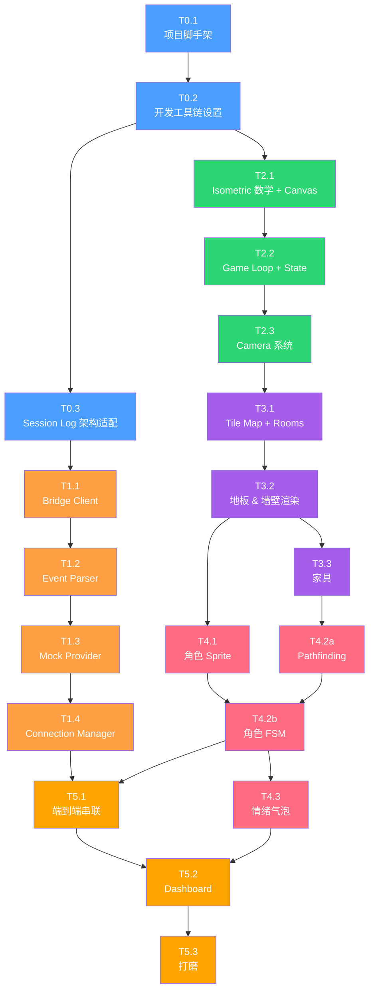

# Watch Claw - 任务分解

> **Version**: 0.2.0
> **Date**: 2026-03-23
> **粒度**：每个任务约半天
> **预估总任务数**：7 个阶段共 28 个任务

---

## 概述

本文档将 Watch Claw MVP 分解为具体的、可顺序执行的任务。每个任务设计为大约**半天**（3-4 小时）的专注开发工作量。

### 阶段总结

| 阶段 | 名称                 | 任务数 | 范围                                                    |
| ---- | -------------------- | ------ | ------------------------------------------------------- |
| P0   | Project Bootstrap    | 3      | 脚手架、工具链、开发环境、架构适配                      |
| P1   | Connection Layer     | 4      | Bridge client、event 解析、mock provider                |
| P2   | Engine Foundation    | 3      | Game loop、isometric renderer、camera                   |
| P3   | World Building       | 3      | Tile map、rooms、furniture                              |
| P4   | Character System     | 4      | Sprites、FSM、pathfinding、emotions                     |
| P5   | Integration & Polish | 3      | 端到端串联、dashboard、打磨                             |
| P6   | v0.2 改进            | 8      | 移除 Mock、Bridge 增强、像素美术、渲染重构、Electron 化 |

---

## Phase 0: Project Bootstrap

### T0.1 — 项目脚手架

> 初始化 Vite + React + TypeScript 项目，搭建完整目录结构。

**依赖**：无（起点）

**工作项**：

- 使用 `pnpm create vite@latest . --template react-ts` 初始化项目
- 配置 `tsconfig.json`，启用 strict mode，设置 path aliases（`@/` → `src/`）
- 配置 `vite.config.ts`，设置 path alias 解析
- 按照 TECHNICAL.md 第 3 节定义的结构创建完整目录：
  - `src/connection/`
  - `src/engine/`
  - `src/world/`
  - `src/ui/`
  - `src/utils/`
  - `public/assets/character/`、`public/assets/tiles/`、`public/assets/furniture/`、`public/assets/ui/`
- 在每个目录中创建 stub `index.ts` 或占位文件
- 设置 `src/main.tsx` → `src/App.tsx`，显示一个基础的 "Watch Claw" 标题
- 验证 `pnpm dev` 能启动并显示页面

**产出**：

- 工作正常的 Vite dev server（`http://localhost:5173`）
- 所有目录已创建并包含占位文件
- TypeScript 编译无错误

**验收标准**：

- [x] `pnpm dev` 启动无错误
- [x] 浏览器显示 "Watch Claw" 文本
- [x] `pnpm build` 产生干净的 production build
- [x] Path alias `@/` 在 imports 中正确解析

---

### T0.2 — 开发工具链设置

> 配置 ESLint、Prettier、Git hooks 和基础测试基础设施。

**依赖**：T0.1

**工作项**：

- 安装并配置 ESLint（TypeScript parser + React plugin）
- 安装并配置 Prettier（2-space indent、single quotes、trailing comma）
- 设置 `.eslintrc.cjs` 和 `.prettierrc`
- 安装 `husky` + `lint-staged` 用于 pre-commit hooks（对 staged 文件进行 lint + format）
- 安装并配置 Vitest（`vitest.config.ts`）
- 写一个简单的测试来验证测试管道可用（例如测试一个 utility 函数）
- 创建 `src/utils/constants.ts`，包含初始常量：
  ```
  TILE_WIDTH = 64, TILE_HEIGHT = 32,
  BRIDGE_WS_URL = 'ws://127.0.0.1:18790',
  BRIDGE_RECONNECT_BASE_MS = 1000,
  BRIDGE_RECONNECT_MAX_MS = 30000,
  CHARACTER_SPEED = 2,
  ANIMATION_FPS = 8,
  DASHBOARD_UPDATE_INTERVAL_MS = 250,
  IDLE_SLEEP_THRESHOLD_S = 30
  ```
- 创建 `src/utils/helpers.ts`，包含基础工具函数：`clamp()`、`lerp()`、`throttle()`、`generateId()`
- 创建 `src/utils/eventBus.ts` —— 轻量级 typed pub/sub（on/off/emit）
- 添加 npm scripts：`lint`、`format`、`typecheck`、`test`
- 更新 `.gitignore`（dist/、node_modules/ 等）

**产出**：

- Linting、formatting 和 testing 管道全部可用
- 核心 utility 模块准备就绪
- Pre-commit hooks 工作正常

**验收标准**：

- [x] `pnpm lint` 运行无错误
- [x] `pnpm format` 格式化所有文件
- [x] `pnpm typecheck` 通过
- [x] `pnpm test` 运行且简单测试通过
- [x] Git commit 触发 lint-staged hook
- [x] `eventBus.ts` 可用：subscribe、emit、unsubscribe

---

### T0.3 — Session Log 架构适配

> 适配已完成的 T0.1/T0.2 工作，添加 Bridge Server 和 Session Log 监控所需的目录与配置。

**依赖**：T0.2

**工作项**：

- 在项目中创建 `bridge/` 目录：
  - `bridge/server.ts` — Bridge Server 入口（~50-80 行 Node.js 脚本）
  - `bridge/README.md` — Bridge Server 用途说明
- 实现 Bridge Server（`bridge/server.ts`）：
  - 读取 `~/.openclaw/agents/main/sessions/sessions.json`，找到最近活跃的 session（按 `updatedAt` 排序）
  - 使用 `fs.watch` 监控该 session 的 JSONL 文件（`~/.openclaw/agents/main/sessions/<session-id>.jsonl`）
  - 启动 WebSocket server 监听 `ws://127.0.0.1:18790`
  - 当 JSONL 文件追加新行时，解析新行并广播给所有已连接的 WebSocket clients
  - 定期重新读取 `sessions.json`（每 5s），检测 session 切换
  - Session 切换时：停止监控旧文件，开始监控新文件，通知 clients
- 更新 `src/utils/constants.ts`：
  - `WS_URL` → `BRIDGE_WS_URL = 'ws://127.0.0.1:18790'`
  - `WS_RECONNECT_BASE_MS` → `BRIDGE_RECONNECT_BASE_MS`
  - `WS_RECONNECT_MAX_MS` → `BRIDGE_RECONNECT_MAX_MS`
- 安装 `concurrently` 依赖，更新 `package.json` 的 `dev` script：
  - `"dev": "concurrently \"vite\" \"tsx bridge/server.ts\""` —— 同时启动 Vite 和 Bridge Server
- 在 T0.1 创建的目录结构中添加 `src/connection/` 下的类型基础文件（如需要）

**产出**：

- `bridge/` 目录及 Bridge Server 实现
- `pnpm dev` 同时启动 Vite dev server 和 Bridge Server
- `constants.ts` 已更新为 Bridge 相关常量

**验收标准**：

- [x] `pnpm dev` 同时启动 Vite 和 Bridge Server
- [x] Bridge Server 在 `ws://127.0.0.1:18790` 监听连接
- [x] Bridge Server 找到最近活跃的 session 并监控其 JSONL 文件
- [x] 新的 JSONL 行被正确解析并广播
- [x] Session 切换时自动跟踪新 session
- [x] `constants.ts` 中的常量名已更新

---

## Phase 1: Connection Layer

### T1.1 — Bridge WebSocket Client

> 实现连接 Bridge Server 的 WebSocket client，支持自动重连。

**依赖**：T0.3

**工作项**：

- 创建 `src/connection/types.ts`：
  - `ConnectionState` 类型（`disconnected` | `connecting` | `connected` | `reconnecting`）—— 无需 `handshaking` 状态
  - `SessionLogEvent` 接口（session log JSONL 行的结构）：
    - `id: string`、`parentId?: string`、`timestamp: string`（ISO 8601）
    - `type: 'session' | 'message' | 'model_change' | 'thinking_level_change' | 'custom'`
    - `message?:`（用于 `type: 'message'` 事件）：
      - `role: 'user' | 'assistant' | 'toolResult'`
      - `content: string | ContentItem[]`（用户消息为 string，assistant/toolResult 为数组）
      - `usage?: { input, output, cacheRead, cacheWrite, totalTokens, cost }`（仅 assistant）
      - `stopReason?: 'toolUse' | 'stop'`（仅 assistant）
  - `BridgeClientOptions` 接口（url、reconnect 设置）
- 创建 `src/connection/bridgeClient.ts`：
  - `BridgeClient` 类，实现连接状态机（见 TECHNICAL.md 第 4.1 节）
  - 4 状态机（无 handshaking）：`disconnected` → `connecting` → `connected`（或 `reconnecting`）
  - `connect(url)` —— 打开 WebSocket，连接成功后直接进入 `connected` 状态
  - `disconnect()` —— 干净关闭
  - 指数退避自动重连（1s → 2s → 4s → ... → 30s 最大）
  - 无 heartbeat/tick 机制（Bridge Server 无需心跳协议）
  - `onEvent(handler)` —— 注册事件监听器，接收 `SessionLogEvent`，返回取消订阅函数
  - `onStateChange(handler)` —— 注册状态变化监听器
  - 适当的清理：disconnect 时关闭 WebSocket、清除计时器
- 编写单元测试：
  - 测试状态转换（connect → connected，无 handshake 步骤）
  - 测试重连退避时间
  - 测试事件回调注册和注销
  - 测试 disconnect 清理

**产出**：

- `BridgeClient` 类，可连接 Bridge Server WebSocket 端点
- 完整的连接生命周期与重连
- 单元测试通过

**验收标准**：

- [x] Client 连接到 `ws://127.0.0.1:18790`（Bridge Server 运行时）或优雅失败
- [x] 重连尝试遵循指数退避模式
- [x] 状态变化正确发出（4 状态，无 handshaking）
- [x] Event handlers 接收到解析后的 `SessionLogEvent` 对象
- [x] `disconnect()` 干净地拆除所有计时器和 WebSocket
- [x] 单元测试覆盖状态机转换

---

### T1.2 — Event Parser + Action Types

> 将 Session Log events 解析为 typed CharacterAction 对象，供 game engine 消费。

**依赖**：T1.1

**工作项**：

- 扩展 `src/connection/types.ts`，添加 Session Log 特定的 event 类型：
  - `SessionLogEvent` 的 `type` 字段区分事件类型：
    - `type: 'session'` —— session 初始化（id、version、cwd）
    - `type: 'message'` + `role: 'assistant'` —— 包含 `text`、`thinking`、`toolCall` content items
    - `type: 'message'` + `role: 'toolResult'` —— 工具执行结果（`exitCode`、`durationMs`）
    - `type: 'message'` + `role: 'user'` —— 用户输入
  - `ContentItem` 类型：`TextContent | ThinkingContent | ToolCallContent | ToolResultContent`
  - `CharacterAction` union type（GOTO_ROOM、CHANGE_EMOTION、WAKE_UP、GO_SLEEP、CELEBRATE、CONFUSED）
  - `RoomId`、`AnimationId`、`EmotionId` 类型
- 创建 `src/connection/eventParser.ts`：
  - `parseSessionLogEvent(event: SessionLogEvent): CharacterAction | null`
  - `TOOL_ROOM_MAP` 常量，映射**小写** tool names 到 rooms/animations/emotions（见 TECHNICAL.md 第 4.2 节）：
    - `exec` → Office（typing, focused）
    - `read` → Living Room（sitting, thinking）
    - `write` → Office（typing, focused）
    - `edit` → Office（typing, focused）
    - `web_search` → Living Room（thinking, curious）
    - `memory_search` → Living Room（thinking, thinking）
    - `glob` / `grep` → Living Room（sitting, curious）
    - `task` → Living Room（think, thinking）
  - 从 `toolCall` content items 中提取 tool name（`content.name` 字段）
  - 根据 `stopReason` 字段判断 session 状态：`toolUse`（继续工作）vs `stop`（任务完成）
  - 处理边界情况：未知 tool names → 默认到 office，格式错误的 events → 返回 null
- 创建 `ActionQueue` 类（见 TECHNICAL.md 第 4.2 节）：
  - 最大大小：3
  - 去重：相同房间的 actions 替换而非入队
  - FIFO pop
- 编写单元测试：
  - 测试每个小写 tool name 映射到正确的 room/animation/emotion
  - 测试 `type: 'session'` event 产生 `WAKE_UP` action
  - 测试 `stopReason: 'stop'` 产生 `GO_SLEEP` action
  - 测试 assistant message 中多个 `toolCall` items 的处理
  - 测试未知 tools 回退到 office
  - 测试 ActionQueue 去重和溢出
  - 测试格式错误的 events 返回 null

**产出**：

- Session Log events 和 CharacterActions 的完整类型系统
- 带可配置映射的 event parser
- 用于角色移动期间缓冲的 ActionQueue
- 覆盖所有映射的单元测试

**验收标准**：

- [x] TOOL_ROOM_MAP 中所有小写 tool names 产生正确的 CharacterActions
- [x] `type: 'session'` → `WAKE_UP`；`stopReason: 'stop'` → `GO_SLEEP`
- [x] 一个 assistant message 含多个 toolCalls 时，每个 tool 产生独立的 action
- [x] Assistant text/thinking content → `GOTO_ROOM(office, type, focused)`
- [x] 未知/格式错误的 events 返回 `null`（不崩溃）
- [x] ActionQueue 遵守最大大小和去重规则
- [x] 所有单元测试通过

---

### T1.3 — Mock Data Provider

> 构建一个 mock event 生成器，模拟真实的 OpenClaw agent 活动，生成 Session Log 格式的事件。

**依赖**：T1.2

**工作项**：

- 创建 `src/connection/mockProvider.ts`：
  - `MockProvider` 类，生成 Session Log 格式的真实 event 序列
  - Session 模拟循环（见 TECHNICAL.md 第 4.3 节）：
    1. 发出 `type: 'session'` event（session 初始化）
    2. 发出 `type: 'message', role: 'user'` event（用户输入）
    3. 循环 10-30 次：
       - 暂停 3-8s → 发出 `type: 'message', role: 'assistant'` 包含 `toolCall` content items
       - 暂停 1-5s → 发出 `type: 'message', role: 'toolResult'` 包含执行结果
    4. 在 tool calls 之间穿插含 `text`/`thinking` content 的 assistant messages
    5. 发出最终 assistant message（`stopReason: 'stop'`）
    6. 暂停 10-30s（idle 期间）
    7. 从步骤 2 重复
  - 加权随机 tool 选择（`write`/`edit` 最频繁、`task` 最少）—— 使用**小写** tool names
  - 每个 event 包含 `id`、`parentId`、`timestamp`（ISO 8601）字段
  - 生成 realistic `usage` 数据（inputTokens、outputTokens、cost）
  - `start(onEvent)` —— 开始生成 events
  - `stop()` —— 停止生成，发出最终 `stop` message
- 编写测试：
  - 测试 start/stop lifecycle 干净（无悬挂计时器）
  - 测试 tool 分布在多次迭代后大致匹配权重
  - 测试 events 格式正确（SessionLogEvent 格式，含正确字段）

**产出**：

- 生成 realistic agent 行为的 MockProvider（Session Log 格式）
- 所有测试通过

**验收标准**：

- [x] 运行 MockProvider 发出 session、user message、assistant（toolCall）和 toolResult events 序列
- [x] Events 格式正确（SessionLogEvent 格式，含 id/parentId/timestamp）
- [x] Tool names 为小写：`write`、`edit`、`read`、`exec`、`web_search` 等
- [x] Tool 分布感觉真实（更多 write/edit，较少 task/web_search）
- [x] `stop()` 清理所有计时器（无内存泄漏）
- [x] Session 循环在 idle 间隔之间重复

---

### T1.4 — Connection Manager + 连接状态 UI

> 协调 Bridge vs Mock mode 切换，并将连接状态暴露给 UI。

**依赖**：T1.3

**工作项**：

- 创建 `src/connection/connectionManager.ts`：
  - `ConnectionManager` 类，协调 `BridgeClient` 和 `MockProvider`
  - `connect()` 时：尝试 Bridge Server 连接。如果失败或超时（5s），自动切换到 MockProvider
  - Bridge 断开时：短暂延迟后切换到 MockProvider，后台继续尝试重连 Bridge Server
  - Bridge 重连成功时：从 Mock 无缝切换回 Bridge
  - 无论数据源如何（Bridge 或 Mock），都发出标准化的 `CharacterAction` events
  - 暴露 `connectionStatus`：`'live'` | `'mock'` | `'connecting'` | `'disconnected'`
  - 暴露 session log 中的 `usage` 数据（tokens、cost）供 dashboard 使用
  - 暴露 `sessionInfo`：model（来自 `model_change` event）、tokens used、session ID（来自 `session` event）
- 创建 `src/ui/ConnectionBadge.tsx`：
  - 小型 React 组件，显示连接状态
  - 绿色圆点 + "Live"（连接到 Bridge Server 时）
  - 黄色圆点 + "Mock"（使用 mock 数据时）
  - 红色圆点 + "Disconnected"（都不可用时）
  - "Connecting..." 状态的动画脉冲圆点
- 将 ConnectionBadge 集成到 `App.tsx`
- 手动集成测试：启动应用，验证显示 "Mock" mode 且 events 正常流动

**产出**：

- 在 live 和 mock 数据之间无缝切换的 ConnectionManager
- UI 中的视觉连接状态指示器
- 来自任一数据源的 events 流向控制台（或 debug div）

**验收标准**：

- [x] 应用启动时显示 "Mock" badge（因为 Bridge Server 未运行）
- [x] ConnectionManager 启动时尝试 Bridge Server 连接，回退到 mock
- [x] Mock provider 的 events 可被观察到（console.log 或 debug UI）
- [x] 如果 Bridge Server 可用，切换会自动发生
- [x] Connection badge 准确反映当前状态
- [x] 清理时无悬挂计时器或 WebSocket 连接

---

## Phase 2: Engine Foundation

### T2.1 — Isometric 数学 + Canvas 设置

> 实现 isometric 坐标系统并设置 Canvas rendering pipeline。

**依赖**：T0.2（可与 P1 并行）

**工作项**：

- 创建 `src/engine/isometric.ts`：
  - `cartesianToIso(col, row)` —— grid 位置 → 屏幕像素偏移
  - `isoToCartesian(screenX, screenY)` —— 屏幕像素 → grid 位置（用于鼠标）
  - `getTileAtScreen(screenX, screenY, camera)` —— 带 camera 偏移的屏幕坐标 → tile 坐标
  - 常量：`TILE_WIDTH`、`TILE_HEIGHT`（从 constants.ts 导入）
  - 工具函数：`tileCenter(col, row)` —— 获取 tile 的中心像素位置
- 创建 `src/ui/CanvasView.tsx`：
  - 挂载一个填满容器的 `<canvas>` 元素
  - 使用 `ResizeObserver` 处理响应式尺寸
  - 处理 `window.devicePixelRatio` 以在 retina 显示器上清晰渲染
  - 运行时监视 DPR 变化（窗口在不同显示器间拖动）via `matchMedia`
  - 暴露 canvas `ref` 供 game engine 使用
  - 禁用 `imageSmoothingEnabled` 实现 pixel-perfect rendering
  - 处理鼠标事件（click、mousemove、wheel）并转换为世界坐标
- 创建 `src/engine/renderer.ts`（初始版本）：
  - `Renderer` 类，接受一个 canvas context
  - `clear()` —— 清除帧
  - `renderDebugGrid(cols, rows)` —— 为开发绘制 isometric grid
  - 测试渲染：绘制一个 10x10 的彩色菱形 isometric grid
- 编写 isometric 数学的单元测试：
  - `cartesianToIso` 和反向转换的往返正确性
  - `isoToCartesian` 在已知屏幕位置正确识别 tiles
  - 边界情况：负坐标、小数位置

**产出**：

- 完全测试覆盖的 isometric 数学工具
- 带 DPR 处理和 resize 支持的 Canvas 组件
- 屏幕上可见的 isometric debug grid

**验收标准**：

- [x] 打开应用显示可见的 isometric 菱形 grid
- [x] Grid 在 retina 显示器上渲染清晰（无模糊）
- [x] 浏览器窗口变化时 Canvas 正确 resize
- [x] Isometric 数学单元测试全部通过（往返、边界情况）
- [x] 鼠标位置可转换为 tile 坐标（hover 时 console.log）

---

### T2.2 — Game Loop + Game State

> 实现 fixed-timestep game loop 和中央 game state 对象。

**依赖**：T2.1

**工作项**：

- 创建 `src/engine/gameLoop.ts`：
  - `GameLoop` 类，使用 fixed timestep（见 TECHNICAL.md 第 4.7 节）
  - `start()`、`stop()`、`pause()`、`resume()`
  - `update(dt)` callback，以固定 60fps 间隔调用
  - `render(interpolation)` callback，在每个 animation frame 调用
  - FPS 追踪（最近 60 帧的滚动平均值）
  - Delta time 上限，防止 spiral of death（最大 100ms）
- 创建 `src/engine/gameState.ts`：
  - `GameState` 接口：
    ```typescript
    interface GameState {
      character: CharacterState
      world: WorldState
      camera: CameraState
      connection: ConnectionInfo
      debug: DebugState
    }
    ```
  - `createInitialGameState()` 工厂函数
  - `CharacterState`：position、state、emotion、animation、path
  - `WorldState` stub（tiles、rooms、furniture —— 在 Phase 3 填充）
  - `CameraState`：offsetX、offsetY、zoom
  - `ConnectionInfo`：status、lastEvent、tokenUsage
  - 通过 eventBus 发送状态变化通知（用于 React UI 更新，节流处理）
- 串联：GameLoop → update(GameState) → Renderer.renderFrame(GameState)
- 添加 FPS 计数器显示（canvas 左下角，可切换）

**产出**：

- 稳定运行在 60fps 的 game loop
- 每帧创建并更新 GameState 对象
- Debug grid 通过 game loop 持续渲染
- FPS 计数器可见

**验收标准**：

- [x] Game loop 稳定运行（FPS 计数器显示 ~60）
- [x] Debug grid 每帧渲染无闪烁
- [x] `pause()` 和 `resume()` 正常工作
- [x] Game state 对象可访问和修改
- [x] Delta time 上限防止帧率尖峰级联

---

### T2.3 — Camera 系统

> 实现视口平移和缩放控制，用于导航 isometric 视图。

**依赖**：T2.2

**工作项**：

- 创建 `src/engine/camera.ts`：
  - `CameraState` 接口：`{ offsetX, offsetY, zoom, targetOffsetX, targetOffsetY }`
  - `pan(dx, dy)` —— 按像素 delta 移动摄像机
  - `zoomTo(level)` —— 设置缩放（float：0.5-5.0，步进 ±0.25），向屏幕中心缩放
  - `centerOn(col, row)` —— 将摄像机居中在某个 tile 位置
  - `worldToScreen(worldX, worldY)` —— 应用 camera 变换
  - `screenToWorld(screenX, screenY)` —— 反向 camera 变换
  - 平滑 camera 插值（每帧 lerp 到目标位置）
  - 缩放范围：最小 1，最大 5
- 从 CanvasView 接入鼠标事件：
  - 鼠标滚轮 → 缩放
  - 中键 + 拖拽（或右键 + 拖拽）→ 平移
  - `renderer.ts` 在渲染前应用 camera 变换
- 创建 `src/ui/ZoomControls.tsx`：
  - +/- 按钮调整缩放
  - 显示当前缩放级别
  - "Reset" 按钮居中视图并重置缩放到默认值
- 将 ZoomControls 集成到 App.tsx 布局中
- 设置初始 camera 位置，将单层楼布局居中在屏幕上

**产出**：

- 通过鼠标和 UI 按钮进行 camera 平移和缩放
- 平滑 camera 动画
- Debug grid 正确缩放和平移

**验收标准**：

- [x] 鼠标滚轮以浮点步进缩放（±0.25，范围 0.5x 到 5x）
- [x] 右键拖拽平滑平移视图
- [x] 缩放控件（+/-/reset）正常工作
- [x] Camera 平滑插值到目标位置
- [x] Grid 在所有缩放级别正确渲染（无间隙、无抖动）
- [x] `centerOn()` 正确定位到给定 tile

---

## Phase 3: World Building（单层楼）

### T3.1 — Tile Map + Room 定义

> 将单层楼布局定义为 tile map，并配置三个房间。

**依赖**：T2.3

**工作项**：

- 创建 `src/world/tileMap.ts`：
  - `TileType` 枚举：`FLOOR_WOOD`、`FLOOR_CARPET`、`WALL`、`DOOR`、`EMPTY`
  - 主楼层 tile map：大约 16x12 grid（可调）
  - 布局设计：
    ```
    Row 0-1:  WALL WALL WALL WALL WALL WALL WALL WALL WALL WALL WALL WALL WALL WALL WALL WALL
    Row 2:    WALL  [--- OFFICE ---]  DOOR  [-- LIVING ROOM --]  DOOR  [-- BEDROOM --]  WALL
    Row 3-8:  WALL   FLOOR(wood)      DOOR   FLOOR(carpet)       DOOR   FLOOR(carpet)    WALL
    Row 9:    WALL  [--- OFFICE ---]  WALL  [-- LIVING ROOM --]  WALL  [-- BEDROOM --]  WALL
    Row 10-11: WALL WALL WALL WALL WALL WALL WALL WALL WALL WALL WALL WALL WALL WALL WALL WALL
    ```
  - `getFloorLayout(): TileType[][]`
  - `buildWalkabilityGrid(layout): boolean[][]` —— floor 和 door tiles 可行走，walls 不可
- 创建 `src/world/rooms.ts`：
  - `Room` 接口：
    ```typescript
    interface Room {
      id: RoomId
      name: string
      bounds: {
        startCol: number
        startRow: number
        endCol: number
        endRow: number
      }
      entryTile: TileCoord // 最近房间的 door tile
      activityZone: TileCoord // 角色坐/站/睡的位置
      furnitureItems: FurniturePlacement[]
    }
    ```
  - 定义三个房间：
    - **Office**：左侧区域，activityZone = 办公椅位置
    - **Living Room**：中间区域，activityZone = 沙发位置
    - **Bedroom**：右侧区域，activityZone = 床位置
  - `getRoomById(id: RoomId): Room`
  - `getRoomForAction(action: CharacterAction): Room` —— 查找给定 action 对应的房间
- 编写单元测试：
  - Walkability grid 有正确的可行走/阻塞 tiles
  - 所有 room activityZones 是可行走的
  - 所有 room entryTiles 是可行走的（doors）
  - 所有三个房间完全封闭

**产出**：

- 包含 3 个房间的完整单层楼 tile map
- 带入口点和活动区域的 Room 定义
- 正确生成的 walkability grid

**验收标准**：

- [x] Tile map 渲染为 isometric 平面图（使用 T2.1 的 debug renderer）
- [x] 三个不同的房间清晰可见，有墙壁分隔
- [x] Doors 连接各房间
- [x] Walkability grid 正确标记墙壁为阻塞
- [x] Room activityZones 和 entryTiles 在可行走 tiles 上
- [x] 单元测试通过

---

### T3.2 — 地板和墙壁渲染

> 使用正确的 isometric 地板 tiles 和墙壁段渲染 tile map。

**依赖**：T3.1

**工作项**：

- 创建占位 sprite 资源（程序化生成或简单 PNG）：
  - `public/assets/tiles/floor-wood.png` —— 温暖的木地板 tile（64x32 isometric 菱形）
  - `public/assets/tiles/floor-carpet.png` —— 地毯地板 tile（64x32）
  - `public/assets/tiles/wall-front.png` —— 正面墙壁（64x64，菱形 + 32px 高度）
  - `public/assets/tiles/wall-side.png` —— 侧面墙壁（64x64）
  - `public/assets/tiles/door.png` —— 门（64x64）
  - 初期可以是简单的彩色形状——pixel art 质量后续提升
- 创建 `src/world/sprites.ts`：
  - `loadSprite(path: string): Promise<HTMLImageElement>` —— 加载 PNG 并缓存
  - `SpriteCache` —— Map<string, HTMLImageElement> 用于已加载的 sprites
  - `preloadAllSprites()` —— 启动时加载所有需要的 sprites
  - 如果 sprite 文件缺失，返回占位彩色矩形
- 更新 `src/engine/renderer.ts`：
  - `renderFloor(ctx, world)` —— 迭代 tiles，在正确的 isometric 位置绘制地板 sprites
  - `renderWalls(ctx, world)` —— 绘制墙壁 sprites（墙壁比地板高，需要正确的高度偏移）
  - `renderDoors(ctx, world)` —— 渲染门
  - 用实际 tile rendering 替换 debug grid
  - 处理绘制顺序：从后到前（isometric 中从左上到右下）
- 验证视觉效果：一个可见的 isometric 单层楼房屋，包含 3 个房间

**产出**：

- 每个房间有不同地板类型的可见 isometric 平面图
- 墙壁围合房间，有门
- Sprites 已加载并缓存

**验收标准**：

- [x] 地板以正确的 isometric 对齐渲染（tiles 之间无间隙）
- [x] 墙壁以正确的高度渲染（比地板高）
- [x] 两种不同的地板类型视觉可区分（office vs living/bedroom）
- [x] 门在视觉上是开放/可通过的
- [x] Sprites 加载无错误；文件缺失时回退到彩色形状
- [x] 绘制顺序正确（tile 边界无视觉故障）

---

### T3.3 — 家具放置

> 在每个房间放置家具并集成到 rendering pipeline。

**依赖**：T3.2

**工作项**：

- 创建 `src/world/furniture.ts`：
  - `FurnitureType` 枚举：`DESK_COMPUTER`、`CHAIR_OFFICE`、`SOFA`、`FIREPLACE`、`BED`、`LAMP`、`BOOKSHELF`、`TABLE`
  - `FurniturePlacement` 接口：
    ```typescript
    interface FurniturePlacement {
      type: FurnitureType
      col: number
      row: number
      spriteKey: string
      zOffset: number // 垂直渲染偏移
      walkable: boolean // 角色能否在此 tile 上行走？
      occupiable: boolean // 角色能否坐/站在这里？（用于椅子、床）
    }
    ```
  - 为每个房间定义家具：
    - **Office**：电脑桌（2 tiles）、办公椅、书架、台灯
    - **Living Room**：沙发、壁炉、茶几、小书架
    - **Bedroom**：床（2 tiles）、床头灯、小桌
- 创建占位家具 sprites：
  - 每种家具类型使用简单的 isometric 彩色形状
  - Sprites 存放在 `public/assets/furniture/`
- 更新 `src/engine/renderer.ts`：
  - 将家具添加到 z-sorted rendering 的 entity 列表
  - 家具在正确的 isometric 位置渲染，带 z-offset
  - 家具与角色正确地遮挡/重叠（depth sorting）
- 更新 walkability grid：家具 tiles 标记为不可行走（`occupiable` tiles 如椅子除外）

**产出**：

- 每个房间有可辨识的家具
- 家具以正确的深度顺序渲染
- Walkability grid 已更新以考虑家具

**验收标准**：

- [x] Office 有可见的电脑桌和椅子
- [x] Living room 有可见的沙发和壁炉
- [x] Bedroom 有可见的床和灯
- [x] 角色无法穿过家具（walkability 检查）
- [x] 角色可以走到 occupiable tiles（椅子、沙发、床）
- [x] Depth sorting：角色在家具后面时正确被遮挡

---

## Phase 4: Character System

### T4.1 — 角色 Sprite + 动画系统

> 创建龙虾帽角色 sprite 和动画帧，构建动画播放系统。

**依赖**：T3.2（需要 renderer 来显示角色）

**工作项**：

- 创建角色 sprites（程序化占位或简单 pixel art）：
  - **Idle**：4 帧（微妙的呼吸/晃动），4 个方向（NE、NW、SE、SW）
  - **Walk**：6 帧（腿部运动），4 个方向
  - **Type**：4 帧（手臂在键盘上移动），1 个方向（面向桌子）
  - **Sleep**：4 帧（胸部起伏、ZZZ），1 个方向（在床上）
  - **Sit**：2 帧（微妙移动），2 个方向
  - **Think**：4 帧（手托下巴、头部倾斜），1 个方向
  - 角色大小：32x48 像素（适合一个 tile，头部 + 龙虾帽超出上方）
  - 龙虾帽：红色/橙色钳形头饰，定义性视觉特征
  - MVP 阶段，程序化 sprites 即可：彩色矩形身体 + 红色三角帽
- 创建动画数据：
  ```typescript
  const ANIMATIONS: Record<AnimationId, AnimationConfig> = {
    idle: { frameCount: 4, fps: 2, loop: true },
    walk: { frameCount: 6, fps: 8, loop: true },
    type: { frameCount: 4, fps: 6, loop: true },
    sleep: { frameCount: 4, fps: 1, loop: true },
    sit: { frameCount: 2, fps: 1, loop: true },
    think: { frameCount: 4, fps: 2, loop: true },
    celebrate: { frameCount: 6, fps: 4, loop: false },
  }
  ```
- 在 `src/engine/character.ts` 中构建动画播放系统（初始版本）：
  - 追踪 `currentAnimation`、`currentFrame`、`frameTimer`
  - `updateAnimation(dt)` —— 推进帧计时器，以正确的 FPS 切换帧
  - `setAnimation(id)` —— 切换动画，重置帧计数器
  - `getCurrentSpriteFrame()` —— 返回当前帧的矩形/图片用于渲染
- 更新 renderer 以绘制角色：
  - 在正确的 isometric 位置绘制角色 sprite
  - 角色与家具在 z-order 中排序（按 row + col 排序）
  - 角色渲染在地板之上，与家具在同一深度平面

**产出**：

- 屏幕上可见的带龙虾帽轮廓的动画角色
- 正确帧率的动画播放
- 角色与家具正确 depth-sorted

**验收标准**：

- [x] 角色在 isometric 地板上可见
- [x] Idle 动画持续播放（微妙的晃动）
- [x] 角色有可辨识的龙虾帽（即使是简单的）
- [x] 切换动画正常工作（idle → walk → type → 等）
- [x] 每个动画的帧率正确（walk 比 idle 快）
- [x] 角色与家具正确 depth-sort

---

### T4.2a — Pathfinding 系统

> 实现基于 tile 的 BFS pathfinding，用于房间间导航。

**依赖**：T3.3（需要 furniture/walkability grid）

**工作项**：

- 创建 `src/engine/pathfinding.ts`：
  - `findPath(from, to, walkabilityGrid): TileCoord[] | null`（BFS 实现，见 TECHNICAL.md 第 4.6 节）
  - 4 方向邻居（N、S、E、W）—— isometric 无对角线
  - 路径结果不包含起始 tile，包含目标 tile
  - 找不到路径时返回 `null`
  - 处理跨房间 pathfinding：角色必须通过 doors
- 创建 `moveAlongPath()` 工具函数：
  - 使用 lerp 在 tiles 之间平滑移动
  - 足够接近时吸附到 tile（距离 < 0.05）
  - 方向计算：根据移动向量确定 NE/NW/SE/SW
- 编写单元测试：
  - 从 office 到 bedroom 的路径经过 doors
  - 无法穿过墙壁的路径
  - 到不可达 tile 的路径返回 null
  - 已在目标位置时路径返回空数组
  - 所有 4 个方向的方向计算

**产出**：

- 通过 doors 在房间间路由的 BFS pathfinding
- 平滑 tile-to-tile 行走的移动插值
- 覆盖所有路径场景的单元测试

**验收标准**：

- [x] `findPath(office, bedroom)` 返回经过 door tiles 的路径
- [x] `findPath` 永远不会穿过墙壁或家具路由
- [x] 对不可达目标返回 `null`
- [x] `moveAlongPath` 产生平滑的逐帧移动
- [x] 方向从移动向量正确确定
- [x] 所有单元测试通过

---

### T4.2b — 角色 FSM

> 实现角色有限状态机，处理 actions 并管理状态转换。

**依赖**：T4.1、T4.2a（需要动画系统和 pathfinding）

**工作项**：

- 在 `src/engine/character.ts` 中实现完整 FSM（见 TECHNICAL.md 第 4.5 节）：
  - 状态：`idle`、`walking`、`typing`、`sitting`、`sleeping`、`thinking`、`celebrating`
  - `processAction(action: CharacterAction)` —— 响应来自 event parser 的 actions：
    - `GOTO_ROOM` → 找到到房间 activityZone 的路径 → 设置状态为 `walking`
    - `WAKE_UP` → 如果在睡觉，过渡到 idle
    - `GO_SLEEP` → GOTO_ROOM(bedroom) + sleep 动画
    - `CELEBRATE` → 播放 celebrate 动画
    - `CONFUSED` → 改变情绪，留在当前房间
  - `update(dt)` —— 状态特定逻辑：
    - `walking`：沿路径移动，更新方向，到达时过渡到目标状态
    - `idle`：检查待处理 actions，超过 IDLE_SLEEP_THRESHOLD 后自动睡觉
    - 其他：检查新的待处理 actions（可中断）
  - 追踪 `prevPosition` 用于 render interpolation（见 TECHNICAL.md renderer 部分）
- 与 GameLoop 集成：`gameLoop.update()` 调用 `character.update(dt)`
- 编写单元测试：
  - 所有状态转换有效（无非法转换）
  - GOTO_ROOM 触发 walking 状态
  - 到达目标触发正确的目标状态
  - Idle 超时后自动睡觉
  - WAKE_UP 只在 sleeping 状态下有效
- 手动测试：通过控制台 dispatch actions，观察角色在房间间行走

**产出**：

- 包含所有状态转换的角色 FSM
- 角色响应所有 CharacterAction 类型
- 与 GameLoop 正确集成

**验收标准**：

- [x] Dispatching `GOTO_ROOM('office')` 让角色走到办公桌
- [x] 角色通过 doors 行走（不穿墙）
- [x] 角色行走时面向正确方向
- [x] 移动时播放 walk 动画，到达时播放目标动画
- [x] 如果角色已在目标房间，直接过渡（不行走）
- [x] Idle 30s 后触发自动睡觉
- [x] Pathfinding 处理角色已在目标位置的情况
- [x] 所有单元测试通过

---

### T4.3 — 情绪气泡系统

> 在角色头顶显示情绪气泡。

**依赖**：T4.2b

- 每种情绪的 16x16 像素气泡：focused、thinking、sleepy、happy、confused、curious、serious、satisfied
- 每个是浮在角色上方的小图标/emoji 风格 pixel sprite
- 简单方案：带小图标的彩色圆圈（例如黄色圆圈 + "Z" 表示 sleepy）
- 连接气泡和角色的小向下三角/箭头
- 在 `src/engine/renderer.ts` 中实现情绪气泡渲染：
  - `renderEmotionBubble(ctx, character)`：
    - 在角色头顶绘制气泡 sprite（偏移角色高度 + 间距）
    - 轻柔的浮动动画（正弦波垂直晃动，1-2px 振幅）
    - 情绪变化时淡入（opacity 在 0.3s 内过渡）
    - 可选在 5-10s 后淡出（如果情绪不变，避免视觉杂乱）
- 与角色 FSM 集成：
  - 每次状态过渡设置情绪
  - 情绪也可独立设置（通过 `CHANGE_EMOTION` action）
- 添加到主 render pipeline（在角色之后绘制，在所有 entities 之上）

**产出**：

- 情绪气泡出现在角色头顶
- 平滑的浮动动画和淡入效果
- 情绪随角色状态变化

**验收标准**：

- [x] 情绪气泡在角色头顶可见
- [x] 气泡轻柔浮动（正弦波晃动）
- [x] 角色状态转换时情绪变化（例如 typing → focused，sleeping → sleepy）
- [x] 不同情绪视觉可区分
- [x] 情绪变化时气泡平滑淡入
- [x] 气泡在所有缩放级别正确渲染

---

## Phase 5: Integration & Polish

### T5.1 — 端到端 Event → Character 串联

> 将 ConnectionManager 连接到 game engine，让 real/mock events 驱动角色。

**依赖**：T1.4、T4.2b（connection layer 和 character system 都必须完成）

**工作项**：

- 串联 `ConnectionManager` → `GameState` → Character：
  - ConnectionManager 通过 callback 发出 CharacterActions
  - Actions 推入角色的 ActionQueue
  - GameLoop 的 update 循环处理队列
- 集成流程验证：
  ```
  MockProvider 发出 SessionLogEvent → EventParser 产生 CharacterAction →
  ConnectionManager 转发到 GameState → Character.processAction() →
  角色走到房间 → 到达 → 播放动画 → 显示情绪
  ```
- 处理快速事件序列：
  - 多个 tool events 快速连续到达 → 角色前往最新的房间（ActionQueue 去重）
  - Session 初始化后跟 tool → 角色醒来并走到 tool 对应的房间
  - `stopReason: 'stop'` 到达时如果在行走中 → 角色重定向到 bedroom
- 处理边界情况：
  - 应用启动时无 events → 角色从 bedroom 睡觉开始
  - Session 中间 mock 切换到 live → 角色继续平滑运行
  - Bridge Server 断开 → 角色走到 bedroom 睡觉（视觉 "offline" 指示器）
- 端到端冒烟测试：运行应用，观察角色对 mock events 响应 2+ 分钟
- **集成测试**（Vitest）：
  - 测试：MockProvider → EventParser → ActionQueue → Character FSM pipeline
    - 发出含 `toolCall: write` 的 assistant message → 验证角色最终在 office 且状态为 `typing`
    - 发出 `stopReason: 'stop'` 的 assistant message → 验证角色最终在 bedroom 且状态为 `sleeping`
    - 发出快速 events → 验证 ActionQueue 去重和优先级排序
  - 测试：ConnectionManager 正确切换 mock ↔ live
    - 无 Bridge Server 启动 → 验证 MockProvider 激活
    - 模拟 Bridge Server 可用 → 验证切换到 live mode
  - 测试：VisibilityManager 正确缓冲 events
    - 模拟 tab hidden → 发出 events → 模拟 tab visible → 验证只应用最新状态
  - 这些测试使用真实模块实例（非 mocks）来验证跨模块契约

**产出**：

- 完整的端到端 event → 可视化 pipeline 正常工作
- 角色正确响应所有 event 类型
- 边界情况优雅处理

**验收标准**：

- [x] 角色响应 mock events 在房间间移动
- [x] 角色在每个房间播放正确的动画（office 打字、living room 坐着、bedroom 睡觉）
- [x] 角色为每个活动显示正确的情绪
- [x] 快速 events 处理无视觉故障（通过队列平滑过渡）
- [x] 30+ 秒无 events 时角色睡觉
- [x] 集成测试通过：event→character pipeline、mock↔live 切换、visibility 缓冲
- [x] 长时间运行无 JavaScript 控制台错误

---

### T5.2 — 状态面板

> 构建侧边栏 dashboard，显示连接状态、agent 状态和 token 使用量。

**依赖**：T5.1

**工作项**：

- 创建 `src/ui/Dashboard.tsx`：
  - **连接区域**：状态指示器（Live/Mock/Disconnected）、Bridge Server URL
  - **Agent 状态区域**：当前状态（Working/Thinking/Idle/Sleeping）、当前 tool 名称、当前房间、当前情绪
  - **Session 区域**：session ID、model name（来自 `model_change` event）、运行时长
  - **Token 使用量区域**：已用 tokens / 限制，简单进度条（数据来自 session log 的 `usage` 字段）
  - **活动日志区域**：可滚动的最近 20 个 events 列表，带时间戳
    ```
    14:32:05  write  → Office
    14:31:58  read   → Living Room
    14:31:42  exec   → Office
    14:31:30  (idle) → Bedroom
    ```
  - 通过 EventBus 订阅 GameState 变化（节流 250ms）
  - 紧凑设计：右侧面板、~280px 宽、深色背景
- Dashboard 样式：
  - 事件日志使用等宽字体
  - 颜色编码的状态指示器
  - Pixel-art 风格的边框/框架样式（可选，简单 CSS）
- 布局：`App.tsx` 渲染 `<CanvasView>`（flex: 1）+ `<Dashboard>`（固定宽度）并排
- 使 dashboard 可折叠/切换（快捷键：`D` 键）

**产出**：

- 显示所有关键信息的功能状态面板
- 基于 events 实时更新
- 与 canvas 并排的简洁、不干扰的布局

**验收标准**：

- [x] Dashboard 显示当前连接状态（开发环境为 Mock）
- [x] 角色切换房间/活动时 agent 状态更新
- [x] 活动日志可滚动，显示带时间戳的近期 events
- [x] Token 使用量区域显示（mock 数据或连接时的真实数据）
- [x] Dashboard 可通过 `D` 键切换
- [x] Dashboard 不导致 canvas rendering 卡顿（节流更新）
- [x] 布局响应式：窄视口时 dashboard 收缩或隐藏

---

### T5.3 — 最终打磨 + 开发文档

> 打磨 MVP 体验、修复视觉问题、更新项目文档。

**依赖**：T5.2

**工作项**：

- **视觉打磨**：
  - 调整 tile 颜色和家具位置以达到视觉平衡
  - 确保角色行走速度感觉自然（不太快也不太慢）
  - 微调每个状态的动画帧率
  - 如有时间，添加微妙的环境细节（例如壁炉光芒、显示器光）
  - 确保龙虾帽清晰可见且可辨识
- **初始 camera 位置**：自动居中并缩放以适配完整的单层楼房屋
- **错误处理**：
  - Bridge WebSocket URL 错误时优雅处理
  - Dashboard 中连接问题的清晰错误信息
  - 正常运行期间控制台无未捕获错误
- **性能验证**：
  - 确认在现代硬件上 60fps
  - 检查内存使用量随时间保持稳定（无泄漏）
  - 使用快速 mock events 测试（压力测试 action queue）
- **更新 README.md**：
  - 项目描述、功能、截图
  - 快速启动说明（`pnpm install && pnpm dev`）
  - 配置（Bridge WebSocket URL、mock mode）
  - 链接到 docs/ 获取详细文档
- **开发体验**：
  - 添加 `pnpm dev:mock` 脚本，强制使用 mock mode（无论 Bridge Server 是否可用）
  - 添加 debug 快捷键：
    - `G` —— 切换 isometric grid overlay
    - `F` —— 切换 FPS 计数器
    - `D` —— 切换 dashboard
    - `M` —— 强制 mock mode
  - 控制台友好：记录连接状态变化、event 解析错误

**产出**：

- 打磨后的、功能完整的 MVP
- 更新的 README 和文档
- 带 debug 工具的良好开发体验

**验收标准**：

- [x] 应用稳定运行 10+ 分钟无错误
- [x] 角色行为感觉自然和响应迅速
- [x] 龙虾帽清晰可见且可辨识
- [x] README 有清晰的安装说明
- [x] Debug 快捷键全部可用（G、F、D、M）
- [x] `pnpm dev` → 5 秒内启动应用
- [x] 正常运行期间无控制台错误
- [x] 内存使用稳定（10 分钟运行无增长）

---

## 依赖关系图



### 并行化机会

两条主要轨道可以并行推进：

```
轨道 A（Connection）:  T0.1 → T0.2 → T0.3 → T1.1 → T1.2 → T1.3 → T1.4 ────────────────┐
                                                                                           ├→ T5.1 → T5.2 → T5.3
轨道 B（Engine+World）: T0.1 → T0.2 → T2.1 → T2.2 → T2.3 → T3.1 → T3.2 → T3.3 → T4.1 → T4.2a → T4.2b → T4.3 ─┘
```

如果两位开发者协作，一人可以专注于轨道 A（connection layer），另一人构建轨道 B（engine + world + character）。他们在 **T5.1（端到端串联）** 汇合。

对于单人开发者，推荐顺序为：

1. **T0.1** → **T0.2** → **T0.3**（bootstrap + 架构适配）
2. **T2.1** → **T2.2** → **T2.3**（尽早让屏幕上出现视觉内容——保持动力！）
3. **T1.1** → **T1.2** → **T1.3** → **T1.4**（数据层）
4. **T3.1** → **T3.2** → **T3.3**（建造房屋）
5. **T4.1** + **T4.2a**（可重叠）→ **T4.2b** → **T4.3**（让角色活过来）
6. **T5.1** → **T5.2** → **T5.3**（将一切串联起来）

这个顺序优先考虑**尽早获得视觉反馈**（第 2 天就能看到屏幕上的 isometric grid），保持高涨的开发动力。

---

## 预估时间线

| 任务                         | 预估时间   | 累计时间    |
| ---------------------------- | ---------- | ----------- |
| T0.1 项目脚手架              | 0.5 天     | 0.5 天      |
| T0.2 开发工具链设置          | 0.5 天     | 1 天        |
| T0.3 Session Log 架构适配    | 0.5 天     | 1.5 天      |
| T2.1 Isometric 数学 + Canvas | 0.5 天     | 2 天        |
| T2.2 Game Loop + State       | 0.5 天     | 2.5 天      |
| T2.3 Camera 系统             | 0.5 天     | 3 天        |
| T1.1 Bridge Client           | 0.5 天     | 3.5 天      |
| T1.2 Event Parser            | 0.5 天     | 4 天        |
| T1.3 Mock Provider           | 0.5 天     | 4.5 天      |
| T1.4 Connection Manager      | 0.5 天     | 5 天        |
| T3.1 Tile Map + Rooms        | 0.5 天     | 5.5 天      |
| T3.2 地板 & 墙壁渲染         | 0.5 天     | 6 天        |
| T3.3 家具                    | 0.5 天     | 6.5 天      |
| T4.1 角色 Sprite             | 0.5 天     | 7 天        |
| T4.2a Pathfinding            | 0.5 天     | 7.5 天      |
| T4.2b 角色 FSM               | 0.5 天     | 8 天        |
| T4.3 情绪气泡                | 0.5 天     | 8.5 天      |
| T5.1 端到端串联              | 0.5 天     | 9 天        |
| T5.2 Dashboard               | 0.5 天     | 9.5 天      |
| T5.3 打磨                    | 0.5 天     | 10 天       |
| **Buffer**                   | **1.5 天** | **11.5 天** |

**MVP 总预估：约 10 个工作日 + 1.5 天 buffer = 约 11.5 个工作日**（按每天半个任务的节奏，大约 2.5 个日历周）。

> **关于 buffer 的说明**：Buffer 考虑了集成阶段（T5.1）的意外复杂度、sprite 创建可能花费更长时间、以及 Bridge Server 与 session log 解析中只有在实际测试时才会暴露的边界情况。

---

## Checklist 总结

- [x] P0：项目可启动、lint、测试、构建、Bridge Server 就绪
- [x] P1：Events 从 Bridge Server（或 mock）流向解析后的 CharacterActions
- [x] P2：Isometric canvas 通过 game loop 渲染、camera 可平移和缩放
- [x] P3：单层楼房屋可见，包含 3 个房间、墙壁、门、家具
- [x] P4：龙虾帽角色在房间间行走、播放动画、显示情绪
- [x] P5：Events 端到端驱动角色行为、dashboard 显示状态、应用已打磨
- [x] P6：Mock 已移除、Bridge 增强、3/4 俯视角像素风重做、Electron 桌面应用

---

## Phase 6: v0.2 改进

### T6.1 — 移除 Mock 数据逻辑（0.5 天）

> 完全移除 Mock 模式，只保留真实 Bridge Server 数据。

**依赖**：T5.3

**删除：**

- `src/connection/mockProvider.ts`
- `src/connection/mockProvider.test.ts`

**修改：**

- `src/connection/connectionManager.ts` — 移除 `MockProvider` 引用、`switchToMock()`、`MOCK_SWITCH_DELAY_MS`、`mock` 状态
- `src/connection/index.ts` — 移除 MockProvider 导出
- `src/App.tsx` — 移除 `forceMock` 快捷键 (M 键)
- `src/engine/gameState.ts` — `DebugState` 移除 `forceMock` 字段；`ConnectionInfo.status` 移除 `'mock'`
- `src/ui/ConnectionBadge.tsx` — 移除 "Mock" 状态，只保留 Live / Connecting / Disconnected
- `package.json` — 移除 `dev:mock` script

**ConnectionManager 新行为：**

- 启动 → 连接 Bridge → 成功则 `'live'`，失败则持续重连（指数退避），状态为 `'connecting'`
- 永不生成假数据

**验收标准：**

- [x] 代码中无任何 `mock` / `Mock` / `MockProvider` 引用
- [x] `pnpm test` 通过（移除 mock 测试后）
- [x] Bridge Server 不可用时 UI 显示 "Connecting..."，不显示 "Mock"
- [x] 角色不会在无真实事件时自动移动

---

### T6.2 — Bridge Server 增强（0.5 天）

> 提升 Bridge Server 的 session 监控灵敏度，增加 session 切换通知。

**依赖**：T6.1

**修改：** `bridge/server.ts`

- 缩短 `SESSION_CHECK_INTERVAL_MS` 从 5000 → 2000
- 用 `fs.watch` 监控 `sessions.json` 文件本身，文件变化时立即触发 `checkForSessionChange()`
- Session 切换时广播 `session_switch` 消息（已有），前端 `BridgeClient` 收到后 dispatch `RESET` action
- 确认 `pnpm dev` script 已正确配置同时启动 Vite + Bridge Server

**修改：** `src/connection/bridgeClient.ts`

- 收到 `_bridge: true, type: 'session_switch'` 消息时，emit 一个特殊事件通知 ConnectionManager（当前是直接跳过 `_bridge` 消息）

**修改：** `src/connection/connectionManager.ts`

- 收到 session switch 通知时 dispatch `RESET` action 重置角色

**验收标准：**

- [x] `pnpm dev` 一站式启动 Vite + Bridge Server
- [x] Bridge Server 在 2s 内检测到 session 切换
- [x] Session 切换时角色自动重置到卧室睡觉
- [x] `sessions.json` 被修改时立即触发检查

---

### T6.3 — 准备像素风美术资源目录结构（0.5 天）

> 搭建 sprite 加载框架和资源目录，支持星露谷风格像素资源。

**依赖**：T6.1

**用户负责**：从 itch.io / OpenGameArt 下载星露谷风格的像素资源

**开发者负责**：准备目录结构和 sprite 加载框架

```
public/assets/
├── tilesets/
│   └── interior.png          # 地板、墙壁 tileset (16x16 或 32x32)
├── furniture/
│   ├── desk-computer.png     # 电脑桌
│   ├── bookshelf.png         # 书架
│   ├── bed.png               # 床
│   ├── sofa.png              # 沙发
│   ├── lamp.png              # 台灯
│   └── ...
├── character/
│   └── character.png         # 角色 spritesheet (walk/idle/sit/type/sleep)
└── ui/
    └── emotion-bubbles.png   # 情绪气泡 sprites
```

**新增文件：**

- `src/engine/spritesheet.ts` — spritesheet 加载、帧切割、动画帧定义

**修改：**

- `src/world/sprites.ts` — 重写为基于 spritesheet 的加载（替代之前的占位逻辑）

**验收标准：**

- [x] spritesheet 加载器能正确切割帧
- [x] 缺少图片时有清晰的 fallback（彩色占位方块 + console 警告）

---

### T6.4 — 坐标系和渲染重构（1 天）

> 从 isometric（等轴测菱形）切换到 3/4 俯视角（星露谷物语风格矩形 tiles）。

**依赖**：T6.3

**当前**：isometric 等轴测渲染（菱形 tiles，z-sorting by col+row）
**目标**：3/4 俯视角 sprite-based 渲染（矩形 tiles，y-sorting）

**重写：**

- `src/engine/isometric.ts` → `src/engine/coordinates.ts`
  - `cartesianToScreen(col, row)` — grid 位置 → 屏幕像素（简单乘以 tile 尺寸）
  - `screenToCartesian(x, y, camera)` — 鼠标位置 → grid 位置
  - 移除所有 isometric 菱形计算
- `src/engine/isometric.test.ts` → `src/engine/coordinates.test.ts`
- `src/engine/renderer.ts` — 完全重写
  - 渲染分层：地板 tiles → 墙壁 → 家具 → 角色 → 情绪气泡 → UI
  - 使用 `ctx.drawImage()` 绘制 sprites（替代 `ctx.fillRect` / `ctx.beginPath`）
  - 按 y 坐标排序实现正确遮挡（3/4 视角标准做法）
- `src/engine/camera.ts` — 简化为 top-down camera
- 更新所有引用 isometric 的文件：`gameState.ts`、`character.ts`、`pathfinding.ts`、`CanvasView.tsx` 等

**验收标准：**

- [x] 地板 tiles 以矩形网格渲染（非菱形）
- [x] 如有 sprite 资源则正确显示；无资源时显示彩色占位
- [x] Camera 平移/缩放在新视角下工作正常

---

### T6.5 — 重建世界地图和房间（0.5 天）

> 按新的房间命名和横排布局重建地图。

**依赖**：T6.4

**房间定义（横排一行）：**

```
┌─────────────┬─────────────┬─────────────┐
│             │             │             │
│   工作室     │    书房      │    卧室     │
│  (Workshop) │   (Study)   │  (Bedroom)  │
│             │             │             │
└─────────────┴─────────────┴─────────────┘
```

**修改：**

- `src/connection/types.ts` — `RoomId` 从 `'office' | 'living-room' | 'bedroom'` 改为 `'workshop' | 'study' | 'bedroom'`
- `src/connection/eventParser.ts` — `TOOL_ROOM_MAP` 中 room 引用更新
- `src/world/tileMap.ts` — 横排 3 房间 tile map（约 24x10 tiles）
- `src/world/rooms.ts` — 更新房间定义：Workshop、Study、Bedroom
- `src/world/furniture.ts` — 用 sprite 引用定义家具放置（位置 + spriteKey）
- `src/engine/pathfinding.ts` — BFS 保持不变，仅更新 grid 尺寸
- `src/engine/character.ts` — 更新 RESET action 中的卧室坐标

**家具配置：**
| 房间 | 家具 |
| ------ | -------------------------------- |
| 工作室 | 电脑桌（双显示器）、办公椅、小书架 |
| 书房 | 大书架、沙发、茶几、台灯 |
| 卧室 | 床、床头柜、台灯 |

**验收标准：**

- [x] 三个房间横排显示，有墙壁和门分隔
- [x] 家具在正确位置显示（sprite 或占位色块）
- [x] 角色可以通过门在三个房间间移动（pathfinding 正确）

---

### T6.6 — 角色精灵图集成（0.5 天）

> 角色渲染从程序化绘制改为 spritesheet 驱动。

**依赖**：T6.5

**修改：**

- `src/engine/character.ts` — 动画系统改用 spritesheet 帧索引
- `src/engine/renderer.ts` — 角色渲染改用 `drawImage()` 从 spritesheet 切割帧

**角色动画帧：**
| 动画 | 帧数 | 方向 | 触发 |
| ------ | ---- | ------------- | --------------- |
| idle | 2-4 | 4向 | 默认 |
| walk | 4-6 | 4向 | GOTO_ROOM |
| type | 2-4 | 1向(面向桌子) | 工作室活动 |
| read | 2 | 1向(面向书架) | 书房活动 |
| sleep | 2-4 | 1向(面向床) | 卧室/idle超时 |

**情绪气泡：** sprite-based，浮在角色头顶

**验收标准：**

- [x] 角色用 spritesheet 渲染（非程序化矩形）
- [x] 行走时有流畅的帧动画
- [x] 不同房间播放不同的状态动画
- [x] 情绪气泡正确显示

---

### T6.7 — Electron 桌面应用集成（1 天）

> 将 Web 项目包装为 Electron 桌面应用，支持系统托盘和置顶。

**依赖**：T6.6

**新增文件：**

- `electron/main.ts` — Electron 主进程入口
  - 创建 BrowserWindow，加载 Vite dev server（开发时）或打包文件（生产时）
  - 窗口选项：无边框或半透明、置顶、可调整大小
  - 系统托盘图标和菜单（显示/隐藏、退出）
- `electron/preload.ts` — 预加载脚本（安全 IPC 通道）
- `electron/tray.ts` — 系统托盘管理

**修改：**

- `package.json` — 添加 Electron 依赖（`electron`、`electron-builder`）、新 scripts：
  - `"dev:electron"` — 同时启动 Vite + Bridge Server + Electron
  - `"build:electron"` — 打包为 macOS .app / .dmg
  - `"pack"` — electron-builder 打包
- `vite.config.ts` — 适配 Electron renderer 构建（base 路径等）
- Bridge Server 集成 — Bridge Server 可选两种模式：
  - 作为独立进程启动（同 v0.1）
  - 由 Electron 主进程 fork 启动（推荐，生命周期统一管理）

**窗口特性：**

- 默认窗口大小：1100x700（canvas + dashboard）
- 支持 always-on-top 切换（托盘菜单或快捷键）
- 窗口位置和大小记忆（下次启动恢复）
- macOS：支持 Dock 图标、点击 Dock 图标恢复窗口

**验收标准：**

- [x] `pnpm dev:electron` 启动 Electron 窗口显示完整 UI
- [x] Bridge Server 由 Electron 主进程 fork 启动和管理
- [x] 系统托盘图标可见，右键菜单有显示/隐藏/退出选项
- [x] Always-on-top 可切换
- [x] 关闭窗口后可通过托盘图标重新打开
- [x] `pnpm build:electron` 生成可分发的 macOS 应用

---

### T6.8 — 端到端验证和打磨（0.5 天）

> 全链路验证 v0.2 改动，打磨体验。

**依赖**：T6.7

**验证项：**

- Bridge Server 连接 → Event 解析 → Character FSM → Renderer 全链路
- 无事件时角色安静待在卧室睡觉
- OpenClaw `write`/`edit`/`exec` → 角色去工作室打字
- OpenClaw `read`/`grep`/`web_search` → 角色去书房
- OpenClaw `stopReason: 'stop'` → 角色回卧室睡觉
- Session 切换 → 角色重置
- Electron 桌面窗口稳定运行

**打磨：**

- 调整行走速度（不过快不过慢）
- 调整动画帧率
- Dashboard 移除 Mock 相关显示
- 更新 README

**验收标准：**

- [x] `pnpm dev:electron` → Electron + Bridge Server + Vite 同时启动
- [x] 窗口显示 "Live"，角色安静睡觉（无事件时）
- [x] 有真实事件时角色正确响应
- [x] `pnpm test` 通过、`pnpm typecheck` 零错误、`pnpm build` 成功
- [x] 10 分钟稳定运行无错误
- [x] Electron 应用打包成功（macOS .app）
